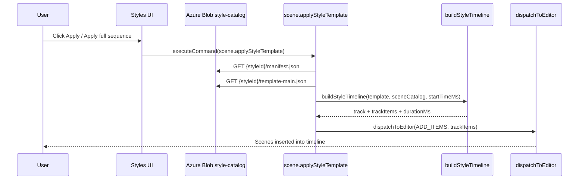

# SkillTown Styles Feature

Audience: AI agents and maintainers working with the SkillTown Style Catalog feature.

## Product

SkillTown exposes creator editing styles as full-scene templates. Users see a **Styles** sidebar tab inside the video editor, browse style cards, open a richer preview dialog, inspect a sample edit, and apply an entire creator-style sequence to the current timeline.

Main product actions:

| UI | User action | Result |
|---|---|---|
| Styles sidebar tab | Browse/search/filter style cards | Reads catalog from Azure Blob Storage. |
| Style card | **View Sample** | Opens `/styles/{styleId}` in a new tab. |
| Style card | **Apply to current** | Runs `scene.applyStyleTemplate` in the active editor. |
| Preview dialog | **View Sample Edit →** | Opens the ephemeral sample editor route. |
| Preview dialog | **Apply full sequence** | Inserts a selected template into the current timeline. |
| Sample banner | **Duplicate as my content** | Calls `POST /api/content/from-style` and redirects to `/content/{contentId}`. |

Current live catalog:

```text
https://prepwithai.blob.core.windows.net/style-catalog/index.json
```

Current style ids:

```text
ankitarora, buildercentral, editingburst, kallaway, keanuvisuals,
mitmonk, motion-backgrounds, sisinty, tharun, varunmayya
```

## Routes

| Route | Purpose | Key files |
|---|---|---|
| `/content/[content_id]` | Main editor route. Includes the Styles sidebar tab in the video editor. | `/Users/shubham/Codes/SkillTown/app/content/[content_id]/components/ContentDetailPageClient.tsx`, `/Users/shubham/Codes/SkillTown/app/content/[content_id]/components/video-editor-v2/menu-list.tsx` |
| `/styles/[styleId]` | Ephemeral read-only sample editor. Applies a style template for preview only, shows a banner, and offers Duplicate. | `/Users/shubham/Codes/SkillTown/app/styles/[styleId]/page.tsx`, `/Users/shubham/Codes/SkillTown/app/styles/[styleId]/SampleContentPageClient.tsx`, `/Users/shubham/Codes/SkillTown/app/styles/[styleId]/SampleModeBanner.tsx` |

### `/content/[content_id]`

The editor sidebar includes a `styles` menu item and renders the Styles gallery. Applying a style inserts generated scene-template timeline items into the active content.

Relevant UI files:

```text
/Users/shubham/Codes/SkillTown/app/content/[content_id]/components/video-editor-v2/menu-list.tsx
/Users/shubham/Codes/SkillTown/app/content/[content_id]/components/video-editor-v2/menu-item/menu-item.tsx
/Users/shubham/Codes/SkillTown/app/content/[content_id]/components/video-editor-v2/menu-item/styles/Styles.tsx
/Users/shubham/Codes/SkillTown/app/content/[content_id]/components/video-editor-v2/menu-item/styles/StyleCard.tsx
/Users/shubham/Codes/SkillTown/app/content/[content_id]/components/video-editor-v2/menu-item/styles/StylePreviewDialog.tsx
```

### `/styles/[styleId]`

This route loads a sample style from Blob and renders it in an editor shell. It is intentionally read-only/sample-only: changes are not persisted. The fixed banner is implemented in:

```text
/Users/shubham/Codes/SkillTown/app/styles/[styleId]/SampleModeBanner.tsx
```

The Duplicate button bridges to:

```text
/Users/shubham/Codes/SkillTown/app/styles/StylesDuplicateBridge.tsx
```

## APIs

### `POST /api/content/from-style`

Authenticated duplicate endpoint. It creates real user content from a style template.

| Property | Value |
|---|---|
| File | `/Users/shubham/Codes/SkillTown/app/api/content/from-style/route.ts` |
| Auth | Requires `getAuthUser()` and `enforceCapability(Cap.ContentEditorOpen)` |
| Method | `POST` |
| Request body | `{ "styleId": "kallaway", "templateId": "template-main", "title": "Sample: Kallaway" }` |
| Response | JSON containing a new `contentId` on success. |
| Source data | `loadStyleTemplateFromBlob(styleId, templateId)` and `loadStyleManifestFromBlob(styleId)` |
| Timeline builder | `/Users/shubham/Codes/SkillTown/lib/styles/buildStyleTimeline.ts` |

Example:

```bash
curl -X POST http://localhost:3000/api/content/from-style \
  -H 'Content-Type: application/json' \
  -d '{"styleId":"kallaway","templateId":"template-main","title":"Sample: Kallaway"}'
```

Requires a browser/session-authenticated context in normal use.

### Blob endpoints

SkillTown reads static catalog files from Azure Blob Storage.

| Endpoint | Purpose |
|---|---|
| `GET https://prepwithai.blob.core.windows.net/style-catalog/index.json` | Style summaries for the gallery. |
| `GET https://prepwithai.blob.core.windows.net/style-catalog/{styleId}/manifest.json` | Full style manifest. |
| `GET https://prepwithai.blob.core.windows.net/style-catalog/{styleId}/template-main.json` | Main style scene template. |
| `GET https://prepwithai.blob.core.windows.net/style-catalog/{styleId}/look.md` | Human-readable style notes. |
| `GET https://prepwithai.blob.core.windows.net/style-catalog/{styleId}/previews/*` | Optional posters/loops. |

Blob base URL can be overridden with `NEXT_PUBLIC_STYLES_URL`; default is declared in:

```text
/Users/shubham/Codes/SkillTown/app/content/[content_id]/components/video-editor-v2/menu-item/styles/useStyleCatalog.ts
/Users/shubham/Codes/SkillTown/lib/styles/loadTemplateFromBlob.ts
```

## Client executors

### `scene.applyStyleTemplate`

Inserts the scenes from a style template into the timeline.

| Property | Value |
|---|---|
| Executor | `/Users/shubham/Codes/SkillTown/app/content/[content_id]/context/AgentCommandQueue/commandExecutorScenes/addScenes.ts` |
| Registration | `/Users/shubham/Codes/SkillTown/app/content/[content_id]/context/AgentCommandQueue/commandExecutorScenes.ts` |
| Type declaration | `/Users/shubham/Codes/SkillTown/app/content/[content_id]/context/AgentCommandQueue/types.ts` |
| Timeline helper | `/Users/shubham/Codes/SkillTown/lib/styles/buildStyleTimeline.ts` |

Command shape:

```json
{
  "type": "scene.applyStyleTemplate",
  "params": {
    "styleId": "kallaway",
    "templateId": "template-main",
    "from_ms": 0,
    "scale": 1,
    "trackHint": "Style: kallaway"
  }
}
```

Result shape:

```json
{
  "inserted": 8,
  "itemIds": ["..."],
  "durationMs": 15000,
  "styleId": "kallaway",
  "templateId": "template-main"
}
```

### `scene.listStyles`

Browses styles from the Blob-backed catalog.

| Property | Value |
|---|---|
| Executor | `/Users/shubham/Codes/SkillTown/app/content/[content_id]/context/AgentCommandQueue/commandExecutorScenes.ts` |
| Loader | `/Users/shubham/Codes/SkillTown/app/content/[content_id]/components/video-editor-v2/menu-item/styles/useStyleCatalog.ts` |
| Result | `{ "styles": [...], "totalAvailable": 10 }` |

Command shape:

```json
{ "type": "scene.listStyles", "params": {} }
```

### `scene.getStyle`

Loads a full manifest for one style.

| Property | Value |
|---|---|
| Executor | `/Users/shubham/Codes/SkillTown/app/content/[content_id]/context/AgentCommandQueue/commandExecutorScenes.ts` |
| Loader | `loadStyleManifest(styleId)` in `useStyleCatalog.ts` |
| Required param | `styleId` |

Command shape:

```json
{ "type": "scene.getStyle", "params": { "styleId": "kallaway" } }
```

## Data flow diagram



ASCII version:

```text
User click Apply
  -> Styles.tsx / StylePreviewDialog.tsx
  -> executeCommand({ type: "scene.applyStyleTemplate" })
  -> useStyleCatalog loads manifest/template from Azure Blob
  -> buildStyleTimeline converts scenes[] to DesignCombo track items
  -> dispatchToEditor(ADD_ITEMS) inserts template scenes
  -> timeline shows a new "Style: {name}" template track
```

## Key files

| File | Purpose |
|---|---|
| `/Users/shubham/Codes/_EditingStyleDetails/scripts/extract-styles.mjs` | Generates `_Style/{styleId}` catalog files from video-engine `data.ts`. |
| `/Users/shubham/Codes/_EditingStyleDetails/scripts/publish-styles.mjs` | Publishes `_Style` catalog files to Azure Blob Storage. |
| `/Users/shubham/Codes/_EditingStyleDetails/_Style/index.json` | Local generated index mirrored to Blob. |
| `/Users/shubham/Codes/_EditingStyleDetails/_Style/{styleId}/manifest.json` | Local style metadata. |
| `/Users/shubham/Codes/_EditingStyleDetails/_Style/{styleId}/template-main.json` | Local scene sequence. |
| `/Users/shubham/Codes/_EditingStyleDetails/_Style/{styleId}/look.md` | Local style notes shown in preview details. |
| `/Users/shubham/Codes/SkillTown/app/content/[content_id]/components/video-editor-v2/menu-item/styles/useStyleCatalog.ts` | Client Blob loader/cache and `useStyleCatalog()` hook. |
| `/Users/shubham/Codes/SkillTown/app/content/[content_id]/components/video-editor-v2/menu-item/styles/types.ts` | TypeScript catalog types. |
| `/Users/shubham/Codes/SkillTown/app/content/[content_id]/components/video-editor-v2/menu-item/styles/Styles.tsx` | Styles sidebar gallery, filtering, and Apply wiring. |
| `/Users/shubham/Codes/SkillTown/app/content/[content_id]/components/video-editor-v2/menu-item/styles/StyleCard.tsx` | Gallery card UI with preview and quick actions. |
| `/Users/shubham/Codes/SkillTown/app/content/[content_id]/components/video-editor-v2/menu-item/styles/StylePreviewDialog.tsx` | Detail dialog with look profile, templates, Apply, and View Sample. |
| `/Users/shubham/Codes/SkillTown/app/styles/[styleId]/page.tsx` | Server route for sample style pages. |
| `/Users/shubham/Codes/SkillTown/app/styles/[styleId]/SampleContentPageClient.tsx` | Client sample editor that applies the template once. |
| `/Users/shubham/Codes/SkillTown/app/styles/[styleId]/SampleModeBanner.tsx` | Read-only/sample-mode banner and Duplicate button. |
| `/Users/shubham/Codes/SkillTown/app/styles/StylesDuplicateBridge.tsx` | Browser bridge that calls `/api/content/from-style`. |
| `/Users/shubham/Codes/SkillTown/app/api/content/from-style/route.ts` | Authenticated duplicate API. |
| `/Users/shubham/Codes/SkillTown/lib/styles/loadTemplateFromBlob.ts` | Server-side Blob loaders for duplicate/sample routes. |
| `/Users/shubham/Codes/SkillTown/lib/styles/loadSampleContent.ts` | Builds ephemeral content for `/styles/{styleId}`. |
| `/Users/shubham/Codes/SkillTown/lib/styles/buildStyleTimeline.ts` | Converts `StyleTemplate.scenes[]` into editor track items. |
| `/Users/shubham/Codes/SkillTown/app/content/[content_id]/context/AgentCommandQueue/commandExecutorScenes/addScenes.ts` | Implements `scene.applyStyleTemplate`. |
| `/Users/shubham/Codes/SkillTown/app/content/[content_id]/context/AgentCommandQueue/commandExecutorScenes.ts` | Registers `scene.applyStyleTemplate`, `scene.listStyles`, and `scene.getStyle`. |

## Extension points

### Add a new field to `manifest.json`

1. Update generated output in `/Users/shubham/Codes/_EditingStyleDetails/scripts/extract-styles.mjs`.
2. Update types in `/Users/shubham/Codes/SkillTown/app/content/[content_id]/components/video-editor-v2/menu-item/styles/types.ts`.
3. Update UI consumers, usually `StyleCard.tsx` or `StylePreviewDialog.tsx`.
4. Regenerate and publish the catalog:

   ```bash
   cd /Users/shubham/Codes/_EditingStyleDetails/scripts
   npm run extract
   npm run publish:dry
   npm run publish
   ```

### Add a new style command

1. Add the command name to `/Users/shubham/Codes/SkillTown/app/content/[content_id]/context/AgentCommandQueue/types.ts`.
2. Implement/register behavior in `/Users/shubham/Codes/SkillTown/app/content/[content_id]/context/AgentCommandQueue/commandExecutorScenes.ts` or a handler file under `commandExecutorScenes/`.
3. If it mutates the timeline, keep `stateManager` and Zustand in sync; follow the pattern in `handleApplyStyleTemplate`.
4. Document the command here and in any relevant agent skill docs.

### Add a new UI element in the gallery

1. For card-level UI, edit `/Users/shubham/Codes/SkillTown/app/content/[content_id]/components/video-editor-v2/menu-item/styles/StyleCard.tsx`.
2. For detail UI, edit `/Users/shubham/Codes/SkillTown/app/content/[content_id]/components/video-editor-v2/menu-item/styles/StylePreviewDialog.tsx`.
3. For gallery filtering/loading behavior, edit `/Users/shubham/Codes/SkillTown/app/content/[content_id]/components/video-editor-v2/menu-item/styles/Styles.tsx` and `useStyleCatalog.ts`.
4. Use explicit light/dark Tailwind classes per `/Users/shubham/Codes/SkillTown/CLAUDE.md`.

### Add a new style

Use the catalog scripts workflow documented at:

```text
/Users/shubham/Codes/_EditingStyleDetails/scripts/README.md
```

Source data belongs in:

```text
/Users/shubham/Codes/remotion-projects/video-engine/src/{styleId}/data.ts
```

Generated runtime files belong in:

```text
/Users/shubham/Codes/_EditingStyleDetails/_Style/{styleId}/
```

## Known limitations

| Limitation | Impact | Notes |
|---|---|---|
| Sample mode has no persistence | Changes on `/styles/{styleId}` are preview-only. | Use **Duplicate as my content** to create real editable content. |
| Previews may be placeholders | Some cards/dialogs show gradients or "Preview coming" instead of rendered media. | Expected until Wave Final Agent A completes preview rendering and publish. |
| Catalog is Blob-backed | If Blob files are stale, SkillTown shows stale data even when local `_Style` changed. | Run `npm run publish` after extraction. |
| `template-main.json` depends on scene ids | Apply fails if a `sceneType` is not available in `@shubham-vish/remotion-templates`. | Validate scene ids before publishing. |
| `SkillTown-Desktop` has no feature-specific style catalog code now | Desktop-specific dead code was removed in Wave 3. | The web app owns this feature. |
| Sample duplicate requires auth | Anonymous users can view sample route but cannot duplicate. | API returns 401 with "Sign in to duplicate". |

## Quick verification checklist

After changing catalog docs or data, verify these manually:

```text
https://prepwithai.blob.core.windows.net/style-catalog/index.json
https://prepwithai.blob.core.windows.net/style-catalog/kallaway/manifest.json
https://prepwithai.blob.core.windows.net/style-catalog/kallaway/template-main.json
http://localhost:3000/styles/kallaway
http://localhost:3000/content/{content_id}
```

In the editor, run or trigger:

```json
{ "type": "scene.listStyles", "params": {} }
{ "type": "scene.getStyle", "params": { "styleId": "kallaway" } }
{ "type": "scene.applyStyleTemplate", "params": { "styleId": "kallaway", "templateId": "template-main", "from_ms": 0 } }
```
