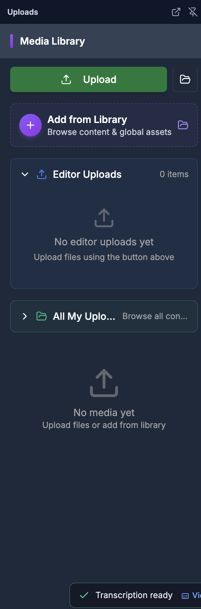
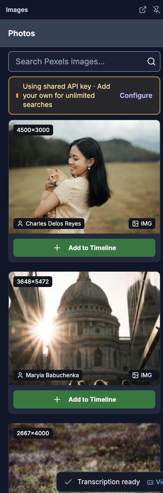
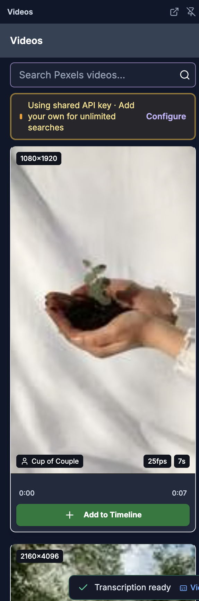
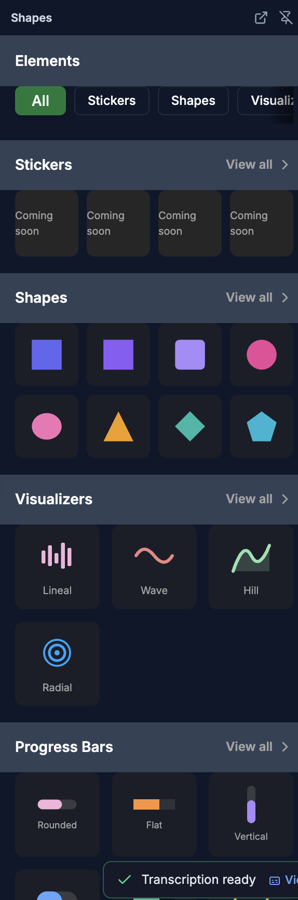
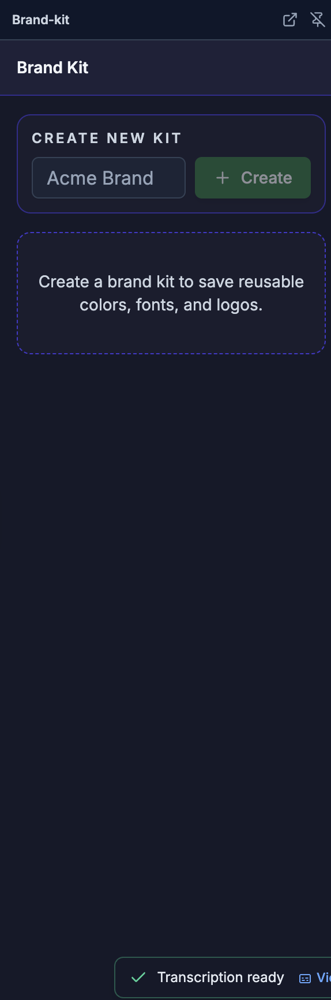

# Media Library

> **For humans — and for AI helping humans.** This document describes how a person edits video by
> hand using the on-screen controls of the SkillTown video editor. It is **not** an AI skill or an
> automation API, so if you are an AI agent, do **not** treat these steps as callable commands — for
> programmatic/automated editing use the agent skills and commands documented elsewhere (see
> `_Agent/AGENTS.md`). **You may, however, read this doc to answer a user's "how do I…" questions
> and walk them, step by step, through performing these actions themselves in the editor UI.**

> Use the media library to upload your own files, browse stock photos and videos, add audio, place shapes and visual elements, and keep brand assets handy.

## Where to find it

Open the editor and use the menu panel. The media-related tabs are **Upload**, **Video**, **Image**, **Shapes**, and **Brand**. On layouts that show the horizontal media row, **Audio** opens the **Audios** panel.

Click a tab once to open its panel. Click the same active tab again to close it. On desktop, the menu panel can also be hidden or shown with **Collapse panel** and **Expand panel**.

## What you can do

- Upload local image, video, and audio files from **Upload**.
- Paste a direct media URL in **Upload** and preview it before saving.
- Browse project assets in **Editor Uploads**, **Content Assets**, **Global Assets**, and **All My Uploads**.
- Search Pexels stock media from **Image** and **Video**.
- Preview, copy, download, or open stock media on Pexels.
- Add built-in audio tracks from **Audios** when the **Audio** tab is available.
- Add **Shapes**, **Visualizers**, and **Progress Bars** from **Shapes**.
- Save reusable **Colors**, **Fonts**, and **Logos** in **Brand Kit**.
- Add media by clicking **Add to Timeline** or by dragging media-library assets onto the timeline.

## How to switch between media tabs

1. Find the menu panel beside the canvas and timeline.
2. Click **Upload** to open the full **Media Library** panel for your own files and saved assets.
3. Click **Video** for stock **Videos**, **Image** for stock **Photos**, **Shapes** for **Elements**, or **Brand** for **Brand Kit**.
4. If your layout shows the horizontal media row, click **Audio** to open **Audios**.
5. To return to editing a selected item, close the active menu tab or select an item so the properties panel can take focus.

## How to upload files

1. Open **Upload**.
2. Click **Upload**. The **Upload media** dialog opens.
3. Either drag files into the area labeled **Drag and drop files here, or** or click **browse files**.
4. The file picker accepts image, video, and audio files. Selected files appear under **Selected files:** with their file name, thumbnail when available, and size in KB or MB.
5. Optional: enter a custom name under **Display name (optional)**. The placeholder is **e.g., Product Demo, Background Music...**, and the helper text says **This name will be shown in the media library**.
6. Click **Upload** to start uploading, or **Cancel** to close the dialog.
7. While files upload, watch **Uploads in Progress**. Waiting files show **Pending**; active uploads show a percentage.

The upload panel accepts media MIME types: `image/*`, `video/*`, and `audio/*`. No visible file-size limit is shown in the upload dialog.

## How to add media from a URL

1. Open **Upload** and click **Upload**.
2. Paste a URL into **Paste media link https://...**.
3. Use a link that starts with `http://` or `https://`. If it does not, you will see **Please enter a valid URL starting with http:// or https://**.
4. The dialog tries to preview common media links:

| Preview state | What you see |
|---|---|
| Video link | A video player with controls |
| Image link | An image preview |
| Audio link | An audio player |
| Loading | **Loading preview...** |
| Broken link | **Failed to load preview** and **The URL may be invalid or inaccessible** |
| Unknown type | **Unknown media type** |

5. If the preview is acceptable, click **Upload**. The URL is saved as media and the dialog notes **Will be used directly**.

## How to browse and add uploaded assets

1. Open **Upload**.
2. Use **Add from Library** to open the **Add from Library** picker. Its helper text is **Browse content & global assets**.
3. Browse the collapsible sections:

| Section | What it contains |
|---|---|
| **Editor Uploads** | Files uploaded from this editor project |
| **Content Assets** | Other assets attached to the current content |
| **Global Assets** | Shared global assets |
| **All My Uploads** | Uploads from other content items, with **Browse all content** |

4. Inside each section, assets are grouped as **Videos**, **Images**, and **Audio**.
5. Click **Add to Timeline** on an asset to add it at the current playhead position.
6. Or drag an asset card onto the timeline. A valid drop lands on the compatible track and time under your cursor; otherwise, the editor creates a new **Dropped Media** track.
7. While an asset is being added, the button changes to **Adding...**.

If **Editor Uploads** is empty, the panel says **No editor uploads yet** and **Upload files using the button above**. If the whole media library is empty, it says **No media yet** and **Upload files or add from library**.

## How to search and browse stock images

1. Open **Image**. The panel heading is **Photos**.
2. The editor loads curated Pexels images automatically.
3. Type a search in **Search Pexels images...** and press Enter or click the search button.
4. Use **Clear** to reset the search and return to curated images.
5. If more results are available, click **Load More**. While loading, the button says **Loading...** and the panel may show **Searching for images...**.
6. Click an image card to open **Image Preview**, or use its menu for **Preview Fullscreen**, **Copy Image URL**, **Download Image**, and **View on Pexels**.
7. Click **Add to Timeline** from the card or preview. A success message says **Image Added** and **Image added at current playback position**.

The image cards can show resolution, photographer credit, and an **IMG** badge.

## How to search and browse stock videos

1. Open **Video**. The panel heading is **Videos**.
2. The editor loads popular Pexels videos automatically.
3. Type a search in **Search Pexels videos...** and press Enter or click the search button.
4. Use **Clear** to reset the search and return to popular videos.
5. If more results are available, click **Load More**. While loading, the button says **Loading...** and the panel may show **Searching for videos...**.
6. Hover over a video card to preview playback. Use the card seek bar to scrub the preview.
7. Use the card menu for **Preview Fullscreen**, **Copy Video URL**, **Download Video**, and **View on Pexels**.
8. Click **Add to Timeline** from the card or from **Video Preview**. A success message says **Video Added** and **Video added at current playback position**.

In **Video Preview**, you can use **Play**, **Pause**, mute/unmute, change playback speed, and click **Close** when done.

| Shortcut | Result |
|---|---|
| Space | Play or pause the preview |
| M | Mute or unmute |
| Left Arrow | Skip back 5 seconds |
| Right Arrow | Skip forward 5 seconds |

## How to configure Pexels search

1. In **Image** or **Video**, look for the Pexels status banner.
2. If no personal key is set, the banner says **Using shared API key · Add your own for unlimited searches**. Click **Configure**.
3. In **Configure Pexels API Key**, follow the on-screen steps and paste your key into **Pexels API Key**. The placeholder is **Paste your Pexels API key**.
4. Click **Save**.
5. When a key is active, the banner says **Personal Pexels API key active**. You can click **Configure** again or **Remove**.
6. In the setup dialog, **Remove Key** clears a saved key, and saving an empty field switches back to the shared key.

## How to add audio from the audio library

1. If your layout shows **Audio**, open it to view **Audios**.
2. Browse the built-in audio list. Each item shows the track name and author, such as **Open AI**, **Dawn of change**, **Hope**, **Tenderness**, and **Piano moment**.
3. Click a track to add it to the timeline, or drag it from the panel.

Uploaded audio files also appear in **Upload** under **Audio**. Click **Add to Timeline** to add uploaded audio at the current playhead position, or drag it onto the timeline.

## How to add shapes, stickers, visualizers, and progress bars

1. Open **Shapes**. The panel heading is **Elements**.
2. Use the category pills **All**, **Stickers**, **Shapes**, and **Visualizers**.
3. In the main view, browse these sections:

| Section | What you can do |
|---|---|
| **Stickers** | Shows placeholder items labeled **Coming soon**. **View all** opens a page that says **Stickers coming soon** and **Animated stickers and emojis will be available here**. |
| **Shapes** | Click a shape thumbnail to add it to the timeline. Click **View all** for the full **Shapes** gallery. |
| **Visualizers** | Click a visualizer thumbnail to add it. Click **View all** for the full **Visualizers** gallery. |
| **Progress Bars** | Click a progress bar thumbnail to add it. Click **View all** for the full **Progress Bars** gallery. |

4. In **Shapes**, filter with **All**, **Basic**, **Arrows**, **Lines**, **Callouts**, and **Decorative**.
5. Available shape labels include **Rectangle**, **Square**, **Rounded Rectangle**, **Circle**, **Ellipse**, **Triangle**, **Diamond**, **Pentagon**, **Hexagon**, **Arrow Right**, **Arrow Left**, **Arrow Up**, **Arrow Down**, **Arrow Diagonal ↗**, **Double Arrow**, **Curved Arrow**, **Block Arrow Right**, **Horizontal Line**, **Vertical Line**, **Diagonal Line**, **Dashed Line**, **Speech Bubble**, **Thought Bubble**, **Banner**, **Star**, **Heart**, **Cross / Plus**, **Octagon**, **Parallelogram**, **Left Bracket**, and **Right Bracket**.
6. In **Visualizers**, filter with **All**, **Progress**, and **Sound Waves**.
7. Progress-bar labels include **Solid Rounded**, **Solid Flat**, **Segmented**, **Gradient**, **Glow**, **Striped**, **Outline**, **Dual Bars**, **Vertical**, **Thin Line**, **Chunky Pill**, **Banner**, **Corner Frame**, **Full Border**, **Thick Frame**, **Thin Border**, **Countdown**, and **Segmented V**.
8. Sound-wave labels include **Lineal 1** through **Lineal 6**, **Radial 1**, **Wave 1**, **Wave 2**, and **Hill 1** through **Hill 4**.

Shapes are added as 5-second items. Progress bars, progress frames, and audio visualizers are added as 10-second items. These element items are inserted at the start of the timeline.

## How to use the brand kit

1. Open **Brand**. The panel heading is **Brand Kit**.
2. Under **Create new kit**, enter a name such as **Acme Brand** and click **Create**.
3. If you have multiple kits, use **Active kit** to choose one. If no kit exists, the panel says **Create a brand kit to save reusable colors, fonts, and logos.**
4. In **Colors**, use **Choose brand color** and click **Add Color**. Each saved color can be removed with its **Remove {color}** control.
5. In **Fonts**, enter a font name such as **Inter** and click **Add Font**. You can also press Enter. Each saved font can be removed with **Remove {font}**.
6. In **Logos**, paste a logo URL such as **https://example.com/logo.png** and click **Add Logo**. Each logo preview can be removed with **Remove logo {number}**.
7. Use **Delete kit** to remove the active brand kit.

Brand kit items are saved for reuse, but this panel does not add a color, font, or logo directly to the timeline by itself.

## Tips & good to know

- **Add to Timeline** in **Upload** adds media at the current playhead position.
- Dragging an uploaded/library asset onto the timeline lets you choose the target time and, when compatible, the target track.
- Dropping files from your computer onto the canvas or timeline adds supported image, video, and audio files immediately, then uploads them in the background.
- If you drop an unsupported file type, the editor shows **Unsupported file type. Drop images, videos, or audio.**
- Uploaded videos and images use default durations while metadata loads: videos start at about 10 seconds, images at 5 seconds, and uploaded audio at about 30 seconds.
- Stock **Image** results add at the current playback position; stock **Video** results also add at the current playback position.
- Pexels image results request 20 items per page; Pexels video results request 15 items per page.
- Curated images and popular videos are cached for 5 minutes in the current editor session.
- Uploaded video cards may show **Clear local cache (force re-download)** for forcing a fresh video download.
- If **Download Failed** or **Could not download the video** appears, the source may be blocked or temporarily unavailable.
- Use **Remove** on an editor upload card to remove it from **Editor Uploads**. This does not describe deleting timeline items.

## Related

- [Editor overview](01-editor-overview.md)
- [Timeline](03-timeline.md)
- [Canvas and properties panel](04-canvas-and-properties.md)
