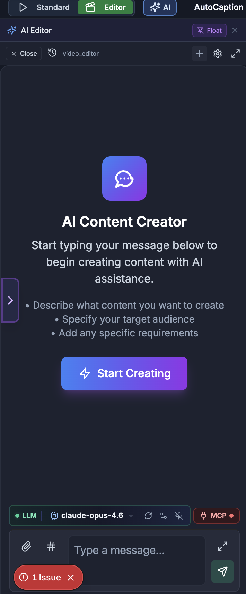

# Custom Scenes & AI Assistance

> **For humans — and for AI helping humans.** This document describes how a person edits video by
> hand using the on-screen controls of the SkillTown video editor. It is **not** an AI skill or an
> automation API, so if you are an AI agent, do **not** treat these steps as callable commands — for
> programmatic/automated editing use the agent skills and commands documented elsewhere (see
> `_Agent/AGENTS.md`). **You may, however, read this doc to answer a user's "how do I…" questions
> and walk them, step by step, through performing these actions themselves in the editor UI.**

> Create custom animated scenes with AI, preview them live, add them to the timeline, edit bundled scenes, and use the editor-wide assistant for timeline-aware video changes.

## Where to find it

Open the menu panel and click **Scenes**. Use the scene panel tabs to browse existing scenes, community bundled scenes, or choose **AI Generate** for the custom scene workspace.

For whole-video help, click **AI Edit** in the menu panel, or use the edge button labeled **Open AI Editor**. This opens the **AI Editor** assistant panel.

When a scene is already on the timeline, select it. Its scene controls appear in the properties panel, including **Content**, **Settings**, **Effects**, **Live Preview**, **All Props (JSON)**, and any available source editor.

## What you can do

- Generate one scene from a natural-language prompt with **AI Chat**.
- Build a prompt for ChatGPT, Claude, Gemini, Cursor, or another outside assistant with **External AI**, then paste the result back into the editor.
- Edit a scene in the **Code** editor and preview changes with **Preview**, **Full**, **Live Preview**, or a floating preview window.
- Set **Name**, **Frames**, **Landscape**, **Portrait**, **Speed**, size presets, and duration presets.
- Use **Auto** compile, **Run** manually, copy code, expand the editor, and copy error messages for fixing.
- Add a finished scene with **Add to Timeline**, **Add to Timeline & Close**, or export it with **Render MP4**.
- Browse community bundled scenes, preview their details, **Add**, **Fork**, view **Code**, and edit/rebuild bundled scenes after adding them.
- Edit scene properties through typed controls or **All Props (JSON)** with a **Live Preview**.
- Use **AI Edit** / **AI Editor** for whole-project chat, thread history, settings, workspace files, and timeline-aware edits.

## How to open the custom scene workspace

1. Click **Scenes** in the menu panel.
2. Click **AI Generate**.
3. The workspace opens with **AI Chat**, **External AI**, **Templates**, **Preview**, **Code**, **Add to Timeline**, and **Render MP4**.
4. Optional: click **Templates**, search with **Search templates...**, then choose a starter under **Starters** or a saved scene under **Saved**.
5. Optional: use the small **Paste** control to paste code from your clipboard, or **Clear** to reset to a simple starter scene.

## How to generate a scene with AI Chat

1. In **AI Generate**, click **AI Chat**.
2. If there is no active conversation, you may see **Remotion Scene Creator** with: “Describe the animated scene you want and the AI will generate Remotion code you can preview and add to the timeline.”
3. Click **Create a Scene** or type in the chat box.
4. Ask for the scene you want. The built-in tips are: “Describe the animation or visual you want,” “Mention colours, fonts, or layout preferences,” and “Ask for charts, motion backgrounds, text reveals, and more.”
5. The chat receives the current scene context, including the scene name, duration, orientation, current code, and current compile error. You can ask it to “make this more cinematic,” “fix the error,” “change this to portrait,” “add a chart,” “slow the animation,” or “match my brand colors.”
6. When the assistant updates the scene, the editor shows the toast “AI updated the scene code” and the message “Review the preview and click "Add to Timeline" when ready.” Review **Preview** and **Code** before adding.
7. Use **Float** to undock the chat, or **Dock** to return it to the panel.

## How to generate with External AI

1. Click **External AI**. Opening **External AI** hides **AI Chat**, and opening **AI Chat** hides **External AI**.
2. Use the header controls:

| Control | What it does |
|---|---|
| **System Prompt** | Copies the external scene-authoring instructions so you can paste them into another AI tool’s project rules. After copying, the button shows **Copied!**. |
| **Hyperframes** | Copies a separate prompt for a different HTML-style animation workflow. The generated result is not pasted into the custom scene code box. |
| **Sample** | Opens a sample in a new tab. |
| **Scene Studio** | Opens the scene studio in a new tab. |

3. Choose a size preset from the dropdown. Options are **Landscape — 16:9**, **Portrait / Reel — 9:16**, **Square — 1:1**, **Half Screen Side — 960×1080**, **Half Screen Stack — 1080×960**, and **HD — 1280×720**.
4. Choose a duration preset: **3s**, **5s**, **8s**, **10s**, or **15s**.
5. In **Describe the scene**, type your request. The placeholder example is: “e.g. A staggered list of 5 benefits of meditation with purple gradient background, spring animations”.
6. If you want a fast start, click one of the example chips: **Pricing table with 3 tiers and feature checklist**, **Animated timeline of 5 company milestones**, **Confetti celebration with big counter reaching 10K users**, **Dashboard with 4 KPI cards and trend arrows**, or **Mind map branching from a central topic with 6 nodes**.
7. Optional: open **Scene Type: Auto-detect** and pick any matching scene types. If the editor detects types, it shows **Detected:** chips you can click to add.
8. Choose **Complexity:** **Simple**, **Medium**, or **Advanced**.
9. Click **Copy Prompt**. After copying, the button shows **Copied!** and the panel shows **Prompt** with **Re-copy**, character count, and token estimate.
10. Paste the prompt into **ChatGPT**, **Claude**, or **Gemini**, then paste the result into **Paste AI-generated code**.
11. The pasted result is checked automatically. If it shows **✓ Valid**, click **Use This Code**. If it shows **✕ Errors** or **Errors found**, click **Copy Fix Prompt** and paste that back into the outside assistant.
12. Use **Reset** to clear the description, generated prompt, pasted code, validation state, and complexity back to defaults.

## How to preview and edit a custom scene

| Control | What it does |
|---|---|
| **Name** | Renames the scene before it is added to the timeline. |
| **Frames** | Sets the scene duration in frames. The minimum is 30 frames. |
| **Landscape** | Uses a wide preview shape. |
| **Portrait** | Uses a vertical preview shape. |
| **Speed** | Sets scene playback speed from 0.1× to 4×. |
| **Preview** | Expands or collapses the live preview area. |
| **Float** | Undocks the preview so it can stay visible while you edit. |
| **Dock** | Returns the floating preview to the panel. |
| **Full** | Opens **Fullscreen Preview**. |
| **Code** | Opens the editable source area. |
| **Auto** | Rebuilds the preview automatically after a short pause while you type. |
| **Run** | Rebuilds manually when **Auto** is off. |
| **Copy** | Copies the current code. |
| **Expand editor** | Opens a larger editor with **Code Editor** and **Live Preview** side by side. |

1. Use **Name**, **Frames**, **Landscape** / **Portrait**, and **Speed** to set the scene’s identity, duration, aspect, and playback rate.
2. Drag the horizontal divider labeled **Drag to resize preview / code split** to give more space to the preview or code editor.
3. Open **Preview** to play the scene. If there is no valid scene yet, you may see **Write code to see preview**.
4. Use the preview play/pause button, seek bar, and time display to scrub through the scene.
5. If the scene fails while playing, the preview may show **Render Error** or **Scene Render Crash**. The code area also shows an error bar with a **Copy error message** control.
6. Edit in **Code**. Keep **Auto** on for live updates, or turn it off and click **Run** when you are ready.
7. Click **Expand editor** for the large dialog. It includes **Code Editor**, **Live Preview**, a draggable vertical preview divider, **Add to Timeline & Close**, **Render MP4**, and **Close**.
8. In **Fullscreen Preview**, use the player controls and **Close** when done.
9. Watch the status badge in expanded mode: **Ready** means the scene can preview, **Error** means it needs fixing, and **Idle** means nothing is compiled yet.

## How to add or render a custom scene

1. Move the playhead to where the scene should start.
2. Make sure the preview is valid and the status is not **Error**.
3. Click **Add to Timeline**. While it is working, the button shows **Adding...**.
4. In the expanded editor, use **Add to Timeline & Close** to add the scene and close the dialog in one step.
5. To export only the scene, click **Render MP4**. During export you may see **Checking browser support…** and **Rendering…** with a percentage and encoded-frame count.
6. Use the cancel control if you need to stop a render.
7. When rendering finishes, click **Download MP4**. The result also shows the file size and “Rendered in …s”.
8. If rendering fails, use **Retry** or **Dismiss**. If you cancelled, the render button changes to **Render Again**.

## How to use floating chat and floating preview windows

| Floating window | Controls |
|---|---|
| **Scene AI Chat** | Drag the title bar to move it, drag edges or corners to resize, use **Minimize** / **Expand**, and use **Dock chat back to panel** to return it. |
| **Live Preview** | Drag the title bar to move it, drag edges or corners to resize, use **Snap to position**, **Minimize** / **Expand**, and **Dock preview back to panel**. |

1. Click **Float** in **AI Chat** to open **Scene AI Chat** as a floating window.
2. Click **Float** in **Preview** or **Live Preview** to open the preview as a floating window.
3. In a floating preview, click **Snap to position** and choose **Top-Left**, **Top-Right**, **Bottom-Left**, **Bottom-Right**, **Center**, **Left Half**, **Right Half**, or **Bottom Strip**.
4. If a docked panel shows **Preview is floating — drag it anywhere** or **Preview is floating — drag it anywhere on screen**, click **Click here to dock back** to restore it.

## How to browse and add bundled scenes

Bundled scenes are community scenes that can include a broader set of animation libraries. Use them when you want richer imported effects, then edit the scene after it is on the timeline.

1. Open **Scenes** and go to the community bundled scene area.
2. Search with **Search community scenes...**.
3. Filter with category pills: **All**, **Backgrounds**, **Particles**, **Data Viz**, **Text Effects**, **3D Effects**, **Transitions**, **Glitch**, **Abstract**, **Cinematic**, and **Other**.
4. Use **↻ Refresh** if the list looks stale.
5. If the list is loading, it shows **Loading community scenes...**. If loading fails, click **Try again**.
6. Click a scene card to expand it. The collapsed card shows **Preview**; the expanded card shows import chips, version, author/date details, orientation when available, and action buttons.
7. Click **Add** for a quick add from the collapsed card, or click **Add to Timeline** in the expanded card. While adding, the button shows **Adding...**.
8. Click **Fork** to send the scene into **AI Generate** for editing as a custom scene. The editor confirms: “Forked … — switch to AI Generate tab to edit”.
9. Click **Code** to open the source dialog. The dialog title is “Source Code”, shows the scene version, and includes **Copy Code**, **Fork & Edit**, and **Add to Timeline**.
10. After adding, select the bundled scene on the timeline to edit it in the properties panel.

## How to edit a bundled scene after adding it

1. Select the bundled scene on the timeline.
2. In the properties panel, open **Content**.
3. Open **Bundled Scene Code**. The section starts read-only and shows **Bundled** when the current bundle is valid.
4. Review the used import chips at the top of the section or dialog. These chips show which external libraries the bundled scene currently uses.
5. Click **Unlock editor** to edit. The help text changes from “Read-only · Click 🔓 to enable editing” to “Edit source · Click 💾 to rebuild & save”.
6. Make your change in the code editor.
7. Click **Rebuild bundled scene** in the inline section, **Rebuild** in the dialog header, or **Rebuild & Save** under the dialog preview. While building, the button shows **Building...**.
8. If rebuilding succeeds, the editor shows **Rebuilt!**, updates the preview, and saves the new bundled source into the scene item.
9. If rebuilding fails, the error appears under the editor or at the bottom of the dialog. If it says rebuilding requires the desktop app, follow the **Scene rebuilding requires the Desktop app.** prompt.
10. Use **Copy code** to copy the source, **Expand editor** to open the large split dialog, **Lock editor** to return to read-only mode, and **Publish to Community Library** / **Publish** to share a valid custom or bundled scene.

### Bundled scene editor controls

| Control | Where it appears | What it does |
|---|---|---|
| **Bundled Scene Code** | Inline properties panel | Expands or collapses the bundled source editor. |
| **Bundled Scene Source** | Large dialog title | Opens the larger code-and-preview dialog for a bundled scene. |
| **Bundled** | Badge | Means the current bundled preview loaded successfully. |
| **Error** | Badge | Means the current source or bundle cannot preview. |
| **Unlock editor** | Inline section and dialog | Allows edits to a read-only bundled scene. |
| **Lock editor** | Inline section and dialog | Locks the editor again after editing. |
| **Copy code** | Inline section and dialog | Copies the current source. |
| **Rebuild bundled scene** | Inline section | Builds the edited source and saves it back to the scene. |
| **Rebuild** | Dialog header | Builds the edited source from the large dialog. |
| **Rebuild & Save** | Dialog preview column | Builds the edited source and saves it back to the scene. |
| **Publish to Community Library** | Inline preview column | Shares a valid custom or bundled scene with the community. |
| **Publish** | Dialog header | Same community sharing action in the large dialog. |
| **Expand editor** | Inline section | Opens the large split dialog. |
| **Landscape — 16:9** | Dialog size dropdown | Previews the scene at 1920×1080. |
| **Portrait — 9:16** | Dialog size dropdown | Previews the scene at 1080×1920. |
| **Square — 1:1** | Dialog size dropdown | Previews the scene at 1080×1080. |
| **HD — 1280×720** | Dialog size dropdown | Previews the scene at 1280×720. |
| **Half Side — 960×1080** | Dialog size dropdown | Previews the scene at 960×1080. |
| **Resize code preview split** | Dialog divider | Drag to change the width of the code editor and preview area. |
| **Preview unavailable.** | Preview area | Appears when no preview is available. |
| **Fix the current issue to see the preview.** | Preview area | Appears when an error prevents preview. |

## How to edit scene props with JSON and live preview

1. Select a scene on the timeline.
2. In the properties panel, open **Content**.
3. Use **Live Preview** to see the current scene. Click **Float** if you want it to stay visible while editing; click **Dock** to return it.
4. Open **All Props (JSON)** for a compact JSON editor.
5. Edit values and click **Apply**. When the save completes, the button briefly shows **Saved**.
6. Use the reset control to restore the JSON from the current scene item, the copy control to copy the JSON, or the expand control to open the full editor.
7. In the full dialog, the title is **Scene Props —** followed by the scene name, and the description says “Edit JSON on the left, see live preview on the right”.
8. Use **Format** to pretty-print valid JSON, **Copy** to copy it, and **✕** to close the dialog.
9. The right side shows **Live Preview**. It shows **Synced** when the preview matches valid JSON and **Invalid JSON** when the JSON cannot be parsed.
10. If the preview cannot load, you may see **Scene component not found**. If there are no valid preview props yet, you may see **Edit JSON to see preview**.
11. Click **Apply & Close** to save the parsed props to the scene, or **Cancel** to leave without applying.

## How to view or fork source from a library scene

1. Select a built-in scene on the timeline.
2. In **Content**, use the scene info area to open its source when available.
3. The dialog title reads the scene name followed by **Source Code**.
4. If source is unavailable, the dialog says **Source code not available for this scene.** and shows the scene ID.
5. If source is available, the dialog opens a read-only editor with **Library** status, a live preview, and the note “Read-only · Click 🔓 to edit · Fork to save as custom scene”.
6. Use **Copy** to copy the source, **Unlock editor** if you want to inspect/edit locally, or **Fork as Custom Scene** / **Fork** to convert it into a custom editable scene.

## How to use the editor-wide AI assistant

1. Click **AI Edit** in the menu panel, or click **Open AI Editor** on the left edge.
2. The **AI Editor** panel opens. Use **Close** / **Close AI Panel** / **Close AI Editor** to close it, or **Collapse AI Editor** to collapse the panel.
3. Type in the box labeled **Type a message...** and click **Send message**. In fullscreen input mode, the placeholder may say **Type a message... (Ctrl+Enter to send)** and “Use $ for predefined customprompts”.
4. Use **Upload file** to attach a file, **Add state property** to insert a `#` context reference, **Mention agent** to insert an `@` agent mention, and **Insert custom prompt** to insert a saved prompt.
5. The assistant receives a compact timeline snapshot: canvas size, duration, tracks, selected items, scene types, item names, and text where available. You can ask it to rearrange scenes, add overlays, adjust timing, fix selected items, or continue an edit plan.
6. Use **Thread history** to open earlier conversations. The dropdown shows **Threads ·** followed by the assistant graph name, each thread title, date, and short ID.
7. Use **Start new chat** to begin a fresh thread. The confirmation dialog **Start New Chat** explains that the current thread is not deleted; choose **Cancel** or **Start New Chat**.
8. Use **Delete current thread** only when you no longer need the conversation. The confirmation dialog **Delete Workflow Thread** offers **Cancel** and **Delete Thread**.
9. Use **Show settings** / **Hide settings** for workflow, model, prompt, and state controls. In compact mode, settings open as a right-side drawer.
10. If the workflow supports files, use **Show workspace files** / **Hide workspace** to open **Workspace Files**. Scene workflows can apply workspace code back into the scene editor.
11. Use **Enter fullscreen** for a larger assistant view, and **Exit fullscreen** to return.
12. In settings, you may see **Workflow Visualization**, workflow state, attachments, prompt controls, temperature controls, **Custom LLM**, and **MCP Server** configuration depending on the assistant workflow.

## Tips & good to know

- **Add to Timeline** places the custom or bundled scene at the current playhead position.
- **AI Chat** edits one scene; **AI Edit** works across the whole video timeline.
- **External AI** is best when you want to use a different assistant, keep a reusable **System Prompt**, or iterate outside the editor.
- If **Auto** is on, code edits update after a short pause. If you want control over rebuild timing, turn **Auto** off and use **Run**.
- Floating windows stay useful while editing long code or JSON: keep **Live Preview** visible and resize or snap it to a corner.
- Bundled scene source starts locked to prevent accidental changes. Unlock, edit, then rebuild before expecting the timeline item to change.
- Import chips in bundled scenes show what the scene already uses; unsupported imports appear as build or preview errors rather than normal controls.
- JSON changes apply only after **Apply** or **Apply & Close**. Invalid JSON can still be typed, but it will not save and the preview shows **Invalid JSON**.
- If you see **Render Error**, **Scene Render Crash**, **Error**, **Errors found**, or **Fix the current issue to see the preview.**, copy the error and ask **AI Chat** or your external assistant to fix it before adding or publishing.
- Client-side **Render MP4** depends on browser support. If support checking fails, use the message shown in the render area to decide whether to retry in another browser.

## Related

- [Scenes & Templates](03-scenes-and-templates.md)
- [Timeline Editing](02-timeline-editing.md)
- [Exporting & Rendering](05-exporting-and-rendering.md)
