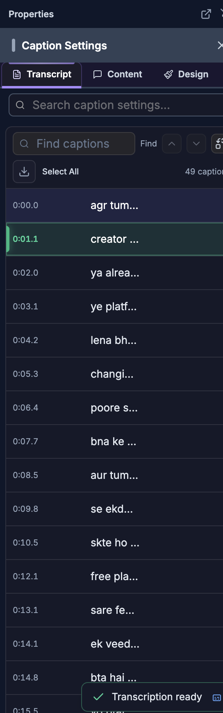

# Text & Captions

> **For humans — and for AI helping humans.** This document describes how a person edits video by
> hand using the on-screen controls of the SkillTown video editor. It is **not** an AI skill or an
> automation API, so if you are an AI agent, do **not** treat these steps as callable commands — for
> programmatic/automated editing use the agent skills and commands documented elsewhere (see
> `_Agent/AGENTS.md`). **You may, however, read this doc to answer a user's "how do I…" questions
> and walk them, step by step, through performing these actions themselves in the editor UI.**

> Add editable text overlays and generate, edit, style, and export captions for speech in your video.

## Where to find it

Open the menu panel and choose **Text** to add a text overlay. Choose **Captions** to create captions from video/audio or from an existing editor transcript.

When you select a text item, the properties panel shows **Design**, **Animate**, and **Effects**. When you select a caption item, the properties panel shows **Transcript**, **Content**, **Design**, **Animate**, and **Effects**. When you select a video or audio clip that can be transcribed, use its **Auto-Captions** tab.

## What you can do

- Add a text layer at the playhead with **Add text**, or drag it onto the timeline.
- Apply text **Preset** cards, choose fonts, set **Weight**, **Size**, **Color**, **Fill**, **Gradient**, **Align**, **Case**, **Decoration**, **Opacity**, typography, padding, stroke, shadow, word colors, animations, keyframes, and effects.
- Generate captions in the **Captions** menu with **Quick Generate** from a selected video/audio item.
- Create captions in the **Captions** menu with **From Transcript** when the editor transcript is ready.
- Transcribe an individual video or audio clip from **Auto-Captions**, watch progress, then use **Add to timeline**.
- Edit caption rows in **Transcript**, including **Find captions**, **Replace with**, **Replace**, **Replace All**, **Split at cursor**, **Merge with next**, **Add caption after**, **Delete caption**, and caption export.
- Style captions with **Words** and **Lines** preset cards, **Caption Words**, **Caption Colors**, manual text styling, **Stroke & Shadow**, **Animations**, **Keyframes**, and **Effects**.

## How to add a text element

1. Open the **Text** menu panel.
2. Click **Add text** to place a new text item at the current playhead position.
3. Or drag **Add text** from the menu panel onto the timeline.
4. Select the text item on the canvas or timeline.
5. Use the properties panel to edit it. New text remembers the last text style you used until you click **Reset Style**.

## How to style text

1. Select a text item.
2. Use **Design** for appearance, **Animate** for motion, and **Effects** for keyframes and effects.
3. Use **Search text settings...** to find a section quickly.
4. Expand the sections you need.

| Section or control | Exact labels and options | What it does |
|---|---|---|
| Text preset area | **Text**, **Preset**, **None**, **Presets** | Opens text preset cards. The visible preset cards preview the word **Text**. |
| Style reset | **Reset Style** | Restores the selected text to the default add-text styling and clears remembered text styling. |
| Main style group | **Text Style**, **Styles** | Holds the main typography, fill, alignment, opacity, and typography controls. |
| Font family | **Font**, **Search fonts...**, **Recent**, **display**, **sans-serif**, **serif**, **handwriting**, **monospace**, **No fonts found** | Chooses the typeface. Some pickers also show **Fonts**, **Search font...**, and **No font found**. |
| Weight | **Weight** | Chooses the selected font style, such as **Regular**, bold, italic, or other available variants. |
| Size | **Size** | Changes text size. Text items support a larger size range than captions. |
| Text color | **Color** | Sets solid text color. It is dimmed while **Gradient** is enabled. |
| Fill/background | **Fill** | Sets the text background/fill color behind the text. On small screens, the color drawer label can read **Background Color**. |
| Gradient | **Gradient**, **Use a text gradient instead of a solid color**, **Color 1**, **Color 2**, **Direction** | Replaces solid **Color** with a two-color gradient and direction angle. |
| Alignment | **Align**, **Left**, **Center**, **Right** | Sets horizontal text alignment. |
| Case | **Case**, **As typed**, **Uppercase**, **Lowercase** | Keeps your typed casing or forces all-uppercase/all-lowercase display. |
| Decoration | **Decoration** | Toggles underline, strikethrough, and overline decoration buttons. |
| Opacity | **Opacity** | Controls text transparency. |
| Typography group | **Typography** | Groups spacing, rounding, rotation, blending, and padding controls. |
| Line spacing | **Line Height** | Changes vertical spacing between lines. |
| Letter spacing | **Letter Spacing** | Changes spacing between letters. |
| Corner rounding | **Border Radius** | Rounds the fill/background corners. |
| Rotation | **Rotation** | Rotates the text item. |
| Word spacing | **Word Spacing** | Changes spacing between words. |
| Blend mode | **Blend Mode**: **Normal**, **Multiply**, **Screen**, **Overlay**, **Darken**, **Lighten**, **Color Dodge**, **Color Burn**, **Hard Light**, **Soft Light**, **Difference**, **Exclusion**, **Hue**, **Saturation**, **Luminosity** | Changes how the text visually blends with layers underneath. |
| Padding | **Padding**, link/unlink button, **Top**, **Right**, **Bottom**, **Left** | Adds space inside the fill/background. Keep linked to edit all sides together, or unlink to edit sides separately. |
| Stroke | **Stroke**, **Color**, **Size**, **Width** | Adds and sizes the text outline. The base stroke uses **Size**; extra stroke layers use **Width**. |
| Extra stroke layers | **Extra Strokes**, **Add Stroke**, **Stroke 1**, **Stroke 2** | Adds more outline layers with separate **Color** and **Width** controls. |
| Shadow | **Shadow**, **Color**, **X**, **Y**, **Blur** | Adds a shadow and controls its color, offset, and blur. |
| Extra shadow layers | **Extra Shadows**, **Add Shadow**, **Shadow 1**, **Shadow 2** | Adds more shadows with separate **Color**, **X**, **Y**, and **Blur** controls. |
| Word colors | **Word Colors**, **Pick colors for individual words.**, **Reset All** | Opens a color picker for each word in plain text. If the item has inline formatting, the panel says **Word colors apply to plain text only. Remove inline HTML formatting to use this control.** If the item is empty, it says **Add some text to style words.** |
| Animate tab | **Animations** | Opens text animation controls. See [Animations & effects](06-animations-and-effects.md) for the broader animation system. |
| Effects tab | **Keyframes**, **Effects** | Animates properties over time and applies visual effects. |

## How to use text presets

1. Select a text item.
2. In **Design**, open the **Text** preset area.
3. Click the **Preset** picker. The floating picker is titled **Presets**.
4. Click **None** to clear preset styling, or click a card that previews **Text** to apply that look.
5. Continue editing in **Text Style** if you want to customize the preset.

Text preset cards are visual style cards, not named style roles. The exact visible labels are **None** and the preview word **Text** on each style card.

The numbers below are manual references for the unnamed style cards; the UI itself shows **None** and preview cards labeled **Text**.

| Manual reference | On-screen preview | What the card applies |
|---|---|---|
| Clear | **None** | Removes preset styling: transparent fill, white text, no stroke. |
| Card 1 | **Text** | fill #000; text #fff; corner radius 20; stroke 0 transparent. |
| Card 2 | **Text** | fill #fff; text #000; corner radius 20; stroke 0 transparent. |
| Card 3 | **Text** | fill transparent; text #fff; corner radius 0; stroke 12 #000. |
| Card 4 | **Text** | fill transparent; text #000; corner radius 0; stroke 12 #fff. |
| Card 5 | **Text** | fill #8120fd; text #fff; corner radius 20; stroke 0 transparent. |
| Card 6 | **Text** | fill #ffde00; text #000; corner radius 20; stroke 0 transparent. |
| Card 7 | **Text** | fill transparent; text #6eb5d6; corner radius 10; stroke 12 #0f1fac; shadow #0f1fac X -12 Y 12 Blur 0. |
| Card 8 | **Text** | fill transparent; text #fff; corner radius 10; stroke 12 #000; shadow #000 X -12 Y 12 Blur 0. |
| Card 9 | **Text** | fill #000; text #6af1af; corner radius 20; stroke 0 transparent. |
| Card 10 | **Text** | fill transparent; text #fff; corner radius 10; stroke 12 #dd4882; shadow #dd4882 X 0 Y 0 Blur 100. |
| Card 11 | **Text** | fill transparent; text #000000; corner radius 10; stroke 0 transparent; shadow #5ed869 X 8 Y 8 Blur 0. |
| Card 12 | **Text** | fill transparent; text #f5be36; corner radius 10; stroke 0 transparent; shadow #b12019 X 8 Y 8 Blur 0. |
| Card 13 | **Text** | fill transparent; text #eed955; corner radius 10; stroke 12 #000000. |
| Card 14 | **Text** | fill transparent; text #5ba2eb; corner radius 10; stroke 12 #ffffff. |
| Card 15 | **Text** | fill transparent; text #ffffff; corner radius 0; stroke 0 transparent. |
| Card 16 | **Text** | fill transparent; text #ffffff; corner radius 0; stroke 2 #000000. |
| Card 17 | **Text** | fill transparent; text #111111; corner radius 0; stroke 2 #ffffff. |
| Card 18 | **Text** | fill transparent; text #ffffff; corner radius 0; stroke 0 transparent; shadow rgba(0, 0, 0, 0.85) X 10 Y 10 Blur 20. |
| Card 19 | **Text** | fill #2c3140; text #d8dde7; corner radius 16; stroke 0 transparent. |
| Card 20 | **Text** | fill rgba(245, 247, 250, 0.82); text #1c2434; corner radius 18; stroke 1 rgba(255, 255, 255, 0.95); shadow rgba(15, 23, 42, 0.18) X 0 Y 8 Blur 24. |
| Card 21 | **Text** | fill #ef233c; text #ffe45c; corner radius 8; stroke 0 transparent. |
| Card 22 | **Text** | fill #2563eb; text #ffffff; corner radius 18; stroke 0 transparent. |
| Card 23 | **Text** | fill #8dff2f; text #101010; corner radius 10; stroke 0 transparent. |
| Card 24 | **Text** | fill transparent; text #ff4343; corner radius 0; stroke 6 #000000. |
| Card 25 | **Text** | fill #6d28d9; text #ffffff; corner radius 14; stroke 0 transparent; shadow rgba(124, 58, 237, 0.45) X 0 Y 8 Blur 18. |
| Card 26 | **Text** | fill #20242f; text #ff8a1f; corner radius 12; stroke 0 transparent. |
| Card 27 | **Text** | fill transparent; text #6ef2ff; corner radius 0; stroke 2 #6ef2ff; shadow #00eaff X 0 Y 0 Blur 52. |
| Card 28 | **Text** | fill transparent; text #ff62d5; corner radius 0; stroke 2 #ff62d5; shadow #ff3fc7 X 0 Y 0 Blur 56. |
| Card 29 | **Text** | fill transparent; text #72ff8f; corner radius 0; stroke 2 #72ff8f; shadow #31ff5f X 0 Y 0 Blur 54. |
| Card 30 | **Text** | fill transparent; text #63b3ff; corner radius 0; stroke 2 #63b3ff; shadow #2563ff X 0 Y 0 Blur 50. |
| Card 31 | **Text** | fill transparent; text #fff26a; corner radius 0; stroke 2 #fff26a; shadow #ffbf47 X 0 Y 0 Blur 48. |
| Card 32 | **Text** | fill transparent; text #ffffff; corner radius 0; stroke 2 #ffffff; shadow rgba(255, 78, 205, 0.95) X 0 Y 0 Blur 64. |
| Card 33 | **Text** | fill transparent; text #f7e4bd; corner radius 0; stroke 0 transparent; shadow #6f4e37 X 12 Y 12 Blur 0. |
| Card 34 | **Text** | fill transparent; text #ff9f1c; corner radius 0; stroke 0 transparent; shadow #8c1c13 X 14 Y 14 Blur 0. |
| Card 35 | **Text** | fill transparent; text #ff89c9; corner radius 0; stroke 0 transparent; shadow #9d174d X 12 Y 12 Blur 0. |
| Card 36 | **Text** | fill transparent; text #8df0c8; corner radius 0; stroke 0 transparent; shadow #14532d X 10 Y 10 Blur 0. |
| Card 37 | **Text** | fill transparent; text #ff7f6a; corner radius 0; stroke 5 #19335a. |
| Card 38 | **Text** | fill transparent; text #ffffff; corner radius 0; stroke 10 #000000. |
| Card 39 | **Text** | fill rgba(0, 0, 0, 0.68); text #ffffff; corner radius 18; stroke 0 transparent. |
| Card 40 | **Text** | fill #ffffff; text #111111; corner radius 18; stroke 0 transparent. |
| Card 41 | **Text** | fill transparent; text #8b5cf6; corner radius 0; stroke 2 #8b5cf6; shadow #ff4fd8 X 0 Y 0 Blur 44. |
| Card 42 | **Text** | fill #ff3cac; text #ffffff; corner radius 20; stroke 0 transparent; shadow rgba(255, 60, 172, 0.55) X 0 Y 10 Blur 24. |
| Card 43 | **Text** | fill #d7c8ff; text #6f52d9; corner radius 16; stroke 0 transparent. |
| Card 44 | **Text** | fill transparent; text transparent; corner radius 0; stroke 8 #ffffff. |
| Card 45 | **Text** | fill transparent; text transparent; corner radius 0; stroke 8 #ff3b30. |
| Card 46 | **Text** | fill transparent; text transparent; corner radius 0; stroke 8 #2563eb. |
| Card 47 | **Text** | fill transparent; text transparent; corner radius 0; stroke 8 #22c55e. |
| Card 48 | **Text** | fill transparent; text #fff7ed; corner radius 0; stroke 6 #fb7185; shadow #312e81 X 8 Y 8 Blur 0. |

## How to generate captions from video or audio

There are two caption-generation entry points. Use the **Captions** menu when you want a quick caption track from an item already on the timeline. Use **Auto-Captions** on a selected video/audio clip when you want per-source transcription progress, settings, and transcript review before adding captions.

### Generate from the Captions menu

1. Add a video or audio item to the timeline.
2. Open the **Captions** menu panel.
3. Choose **Quick Generate**.
4. Open **Select media** and choose the video or audio item.
5. If no media is selected, the panel says **Select video or audio and generate captions automatically.** If no video or audio exists, it says **Add video or audio and generate captions automatically.**
6. When a selected item has no captions yet, the panel says **Recognize speech in the selected video/audio and generate captions automatically.**
7. Click **Generate**. During transcription, the button changes to **Generating...**.
8. When captions are created, they appear on a new **Captions** track. The menu list shows each caption’s time range and text; click a row to seek the player to that caption.

### Generate from a selected clip with Auto-Captions

1. Select a video or audio clip.
2. Open the clip’s **Auto-Captions** tab.
3. If the clip has no transcript yet, the panel says **No transcription for this recording yet.** Click **Transcribe this clip**.
4. While transcription runs, the progress UI appears. If it stalls, you may see **This is taking longer than expected. You can keep waiting or cancel.** Click **Cancel** to stop it.
5. If transcription fails, the panel shows the error and a **Retry** button.
6. If no speech is detected, the panel says **No speech detected in this clip's audio.**
7. When transcription succeeds, the header shows **Transcription ready**, the word count, and **Per-source transcript**.
8. Click **Add to timeline** to create captions. After captions are added, the header can show **Captions added** and the button changes to **Add again (duplicate track)**.
9. Use **Re-transcribe** to run transcription again, or **Config** to open **Transcription settings — adjust before the next transcript or re-transcribe**.
10. Use **Table** to review transcript words, or **Trim Silence** to edit the recording around transcript gaps before creating or updating captions.

The **Auto-Captions** transcript is per source recording. If you split the same recording into multiple clips, the same source transcript can be reused.

## How to generate captions from an existing transcript

1. Open the **Captions** menu panel.
2. Choose **From Transcript**.
3. If no transcript exists, the panel shows **No Editor Transcript**, **Generate a transcript from your timeline audio first to create captions from it.**, and **Use the Transcript panel in your content view to transcribe the editor audio, then return here to add captions.**
4. If an editor transcript exists, the panel shows **Editor Transcript Ready** and the number of available words.
5. Click **Generate Captions from Transcript**.
6. Captions are added to a new track with word-level timing. The panel confirms with **Captions added to timeline successfully!** or reports **Failed to add captions to timeline**.

## How to read transcription progress and transcript tools

| State or control | What you see | What to do |
|---|---|---|
| No transcript | **No transcription for this recording yet.**, **Transcribe this clip** | Start transcription for the selected source recording. |
| Processing | Progress display, **Cancel** | Wait, or cancel if needed. |
| Slow processing | **This is taking longer than expected. You can keep waiting or cancel.** | Keep waiting or click **Cancel**. |
| Cancelled | **Transcription cancelled.** | Start again with **Transcribe this clip** or **Re-transcribe**. |
| Failed | Error text, **Retry** | Try the transcription again. |
| No words | **No speech detected in this clip's audio.** | Choose a different clip or audio source. |
| Ready | **Transcription ready**, word count, **Per-source transcript** | Review words, then click **Add to timeline**. |
| Already added | **Captions added**, **Add again (duplicate track)** | Add a duplicate caption track only if you intentionally want another styled copy. |
| Transcript table | **Table** | Review and edit transcript words in the table view. |
| Silence trimming | **Trim Silence**, **Settings**, **Gap threshold**, **Shorten to**, **Jump to playhead**, **Remove all**, **Shorten all**, **Split all** | Inspect pauses and optionally remove, shorten, or split source silence before using captions. |
| Gap pill actions | **Remove — delete this silence and close the gap**, the tooltip beginning **Shorten — trim this silence to**, **Split — cut the media at this gap (keeps all segments)** | Use the icons on a gap pill to edit silence one gap at a time. Disabled gaps explain why, such as **Timeline spacing only**, **Pause already outside visible clip**, or **This display gap cannot be cut safely**. |
| Word actions | **Seek to** a word, **Delete word from recording**, **Restore word** | Click a word to seek, delete a word from the recording edit, or restore a deleted word. |

## How to edit caption text and timing

1. Select a caption item.
2. Open the **Transcript** tab in the properties panel.
3. Click a caption row to select it and seek to its start. The active row follows the playhead.
4. Click the field labeled **Edit caption text** and type your correction. Edits save shortly after you stop typing or when you leave the field.
5. Use **Find captions** to search. Press Enter for the next match or Shift+Enter for the previous match. The counter shows **Find** before searching and then shows counts like **1 of 3 matches**.
6. Click the replace toggle to show **Replace with**. Use **Replace** for the current match or **Replace All** for every match.
7. If multiple caption tracks exist, use **All tracks** or choose a specific track.
8. Hover a caption row to reveal edit buttons:
   - **Play from here** starts playback at that caption.
   - **Split at cursor** splits the caption at the text cursor and redistributes timing across the two captions.
   - **Merge with next** combines the current caption with the next caption and extends timing to cover both.
   - **Add caption after** inserts a blank caption after the current caption.
   - **Delete caption** removes that caption.
9. Use **Select All** to select all visible caption rows.
10. Use **Export captions** and choose **Export as SRT** or **Export as VTT**.
11. For exact placement, drag or trim caption items directly on the timeline.

Keyboard shortcuts in caption text fields:

| Shortcut | Result |
|---|---|
| Enter | Move to the next caption. |
| Shift+Enter | Move to the previous caption. |
| Alt+Enter | Split at the cursor, or add a caption after if the cursor is at the end. |
| Alt+Backspace | Merge with the previous caption when the cursor is at the start. |
| Arrow Up | Move to the previous caption when the cursor is at the start. |
| Arrow Down | Move to the next caption when the cursor is at the end. |
| Escape | Leave the caption text field. |
| Cmd/Ctrl+H | Show or hide replace controls while searching. |

You can also double-click a selected caption on the canvas. The hint says **Double-click to edit**.

## How to choose caption style presets

1. Select a caption item.
2. Open **Content**.
3. Expand **Preset**.
4. Choose **Words** for word-level styles or **Lines** for line-based styles.
5. Use **Search presets...** to filter preset names. If none match, the grid says **No presets found**.
6. Use **Change preview background — preview how captions look on your video** to test contrast. The preview row is labeled **Preview background — see how captions look on your video color**.
7. Built-in preview colors are **Dark**, **White**, **Gray**, **Green**, **Blue**, and **Red**. Use **Pick custom color** for another color, or **Reset** to clear the preview background.
8. Use **Preview with your own text...** to test a style with your wording. Use **Clear custom text** to clear it.
9. Click **None** to remove preset styling, or click a preset card to apply it.
10. If you edit a preset-styled caption afterward, the preset badge can show **Modified**. Click **Modified** to **Reset to original preset**.

Caption preset names:

| # | Preset | # | Preset | # | Preset |
|---:|---|---:|---|---:|---|
| 1 | **None** | 2 | **Dynamic 1** | 3 | **Dynamic 2** |
| 4 | **Dynamic 3** | 5 | **Typewriter Classic** | 6 | **Transparent Border** |
| 7 | **Fire Bold** | 8 | **Golden Glow** | 9 | **Neon Yellow** |
| 10 | **Modern Shadow** | 11 | **Hormozi Style** | 12 | **Green Scale** |
| 13 | **Beasty Bold** | 14 | **Gray Highlight** | 15 | **Cyan Highlight** |
| 16 | **Purple Bold** | 17 | **Modern Pop** | 18 | **Blue Karaoke** |
| 19 | **Word Animation** | 20 | **Olive Green** | 21 | **White Shadow** |
| 22 | **Green Highlight** | 23 | **Yellow Bold** | 24 | **Colorful Pop** |
| 25 | **Green Word Effect** | 26 | **Classic Black** | 27 | **Green Accent** |
| 28 | **Purple Fill** | 29 | **Blue Motion** | 30 | **Cyan Pop** |
| 31 | **Motion White** | 32 | **Green Bebas Motion** | 33 | **Purple Scale** |
| 34 | **Purple Encode Motion** | 35 | **Red Outline** | 36 | **Lime Mono Block** |
| 37 | **Purple Motion** | 38 | **Lime Alfa Outline** | 39 | **Lime Mono Motion** |
| 40 | **Shadow Word** | 41 | **White Motion** | 42 | **Yellow Alfa Motion** |
| 43 | **Green Alfa Motion** | 44 | **Pink Alfa Fill** | 45 | **Cyan Alfa Motion** |
| 46 | **Mint Alfa Motion** | 47 | **Green Knewave Motion** | 48 | **Cyan Knewave Scale** |
| 49 | **Knewave Word** | 50 | **Lime Mono Outline** | 51 | **Green Outline** |
| 52 | **Green Fjalla Scale** | 53 | **White Fjalla Scale** | 54 | **White Word Flash** |
| 55 | **Red Word Fill** | 56 | **White Word Border** | 57 | **Green Word Sigma** |
| 58 | **Anonymous Word** | 59 | **Marker Word** | 60 | **Purple Alfa Fill** |
| 61 | **White Atma Outline** | 62 | **Cyan Alfa Caps** | 63 | **Shadow Word Bold** |
| 64 | **Lime Motion** | 65 | **Anonymous Border Word** | 66 | **Alfa Word Bold** |
| 67 | **Green Alfa Outline** | 68 | **White Mono Block** | 69 | **Impact Word** |
| 70 | **Cyan Alfa Fill** | 71 | **White Alfa Motion** | 72 | **White Mono Motion** |
| 73 | **Sigma Word Shadow** | 74 | **Sigma Word Glow** | 75 | **Orange Sigma Outline** |
| 76 | **Sigma Word Motion** | 77 | **Golden Sigma Word** | 78 | **Indigo Sigma Fill** |
| 79 | **Lime Imbue Motion** | 80 | **White Imbue Motion** | 81 | **Lime Modern Keyword** |
| 82 | **Yellow Sigma Block** | 83 | **Green Andada Keyword** | 84 | **White Andada Shadow** |
| 85 | **White Poppins Block** | 86 | **Pink Alfa Motion** | 87 | **Red Bebas Keyword** |
| 88 | **Green Rubik Keyword** | 89 | **Yellow Poppins Keyword** | 90 | **White Poppins Caps** |
| 91 | **White Sigma Motion** | 92 | **Pink Sigma Motion** | 93 | **Red Sigma Keyword** |
| 94 | **Cyan Sigma Motion** | 95 | **White Cabin Motion** | 96 | **Yellow Cabin Outline** |
| 97 | **Red DMSans Style** | 98 | **White Cabin Style** | 99 | **Lime Bebas Keyword** |
| 100 | **White Cabin Accent** | 101 | **White Sigma Accent** | 102 | **White Modern Motion** |
| 103 | **Lime Modern Accent** | 104 | **White Inter Keyword** | 105 | **Yellow Fredoka Keyword** |
| 106 | **Cyan Lemonada Keyword** | 107 | **Yellow Bold Keyword** | 108 | **White Chelsea Keyword** |
| 109 | **Leo Word** | 110 | **Yellow Basker Keyword** | 111 | **White Modern Shadow** |
| 112 | **Rose Fredoka Keyword** | 113 | **Lime Neuton Style** | 114 | **Lime Modern Caps** |
| 115 | **Rose Bold Keyword** | 116 | **Yellow DMSans Keyword** | 117 | **Yellow Inter Keyword** |
| 118 | **Lime Lemonada Keyword** | 119 | **Yellow LilitaOne Keyword** | 120 | **Yellow Inter Scale** |
| 121 | **Lime PublicSans Keyword** | 122 | **Lime Bebas Accent** | 123 | **White Modern Keyword** |
| 124 | **Lime Bold Keyword** | 125 | **Rose Inter Keyword** | 126 | **Yellow Keyword** |
| 127 | **White Inter Shadow** | 128 | **Purple Inter Keyword** | 129 | **Cyan Roboto Keyword** |
| 130 | **Cyan Rubik Keyword** | 131 | **Purple Bold Keyword** | 132 | **Blue Sigma Keyword** |
| 133 | **Lime RobotoSlab Keyword** | 134 | **Indigo Fredoka Keyword** | 135 | **Black CaveatBrush Shadow** |
| 136 | **White AguafinaScript Keyword** | 137 | **White Cabin Block** | 138 | **Yellow Serif Glow** |
| 139 | **Red Rubik Keyword** | 140 | **White Serif Keyword** | 141 | **Red Keyword** |
| 142 | **Yellow Serif Keyword** | 143 | **Blue Serif Block** | 144 | **Indigo Inter Keyword** |
| 145 | **Lime Chivo Keyword** | 146 | **Red Inter Keyword** | 147 | **Green Keyword** |
| 148 | **Green Staat Keyword** | 149 | **Red Staat Keyword** | 150 | **Green Shadow** |
| 151 | **Green Fill** | 152 | **Green Style** | 153 | **Green Fredoka Keyword** |
| 154 | **White Keyword** | 155 | **Red Fill** | 156 | **Purple Keyword** |
| 157 | **Green Fredoka Accent** | 158 | **White Secular Block** | 159 | **Red Julius Keyword** |
| 160 | **Green Modern Keyword** | 161 | **White Modern Block** | 162 | **Gray Keyword** |
| 163 | **Lime Keyword** | 164 | **Lime Accent** | 165 | **Green Julius Keyword** |
| 166 | **Black Julius Caps** | 167 | **Purple Accent** | 168 | **White Sigma Block** |
| 169 | **Gray Cabin Keyword** | 170 | **Green Secular Keyword** | 171 | **White Inter Block** |
| 172 | **Green Left** | 173 | **Lime Outline** | 174 | **Lime Shadow** |
| 175 | **Lime Style** | 176 | **Green Changa Keyword** | 177 | **Green Sigma Keyword** |
| 178 | **Green Modern Accent** | 179 | **White Accent** | 180 | **Green Bungee Keyword** |
| 181 | **Green Changa Accent** | 182 | **Purple Outline** | 183 | **Cyan Keyword** |
| 184 | **Purple Shadow** | 185 | **Green Inter Keyword** | 186 | **White Outline** |
| 187 | **Lime Block** | 188 | **Black Keyword** | 189 | **Black Accent** |
| 190 | **Yellow Inter Accent** | 191 | **Yellow Lobster Keyword** | 192 | **Green Inter Accent** |
| 193 | **Green Roboto Keyword** | 194 | **Purple Style** | 195 | **Green Pacifico Keyword** |
| 196 | **Purple Secular Keyword** | 197 | **Green Inter Block** | 198 | **Green Block** |
| 199 | **Purple Glow** | 200 | **White Left** | 201 | **Purple Left** |
| 202 | **Yellow Sigma Keyword** | 203 | **Green Staat Accent** | 204 | **Green Caps** |
| 205 | **Purple Modern Keyword** | 206 | **White PlayfairDisplay Keyword** | 207 | **Green Roboto Fill** |
| 208 | **Red Rubik Accent** | 209 | **Indigo Inter Shadow** | 210 | **White Style** |
| 211 | **Black Poppins Keyword** | 212 | **Lime Modern Outline** | 213 | **Yellow Sigma Fill** |
| 214 | **White Modern Accent** | 215 | **Black Outline** | 216 | **Cyan Francois Motion** |
| 217 | **Lime Francois Motion** |  |  |  |  |

## How to tune caption words, highlighting, and timing

1. Select a caption item.
2. Open **Content** and expand **Caption Words**.
3. Use the word grouping controls to decide how generated word timings are displayed.

| Control | Exact options | What it does |
|---|---|---|
| **Lines per Page** | **One**, **Two**, **Three**, **Four**, **Five** | Regroups transcript words into caption blocks with more or fewer lines. |
| **Words per line** | **Punctuation**, **Time**, **Single Word** | **Punctuation** splits on punctuation or pauses; **Time** makes short timed chunks; **Single Word** creates one caption per word. |
| **Words in line** | **Page**, **Line**, **Word** | Controls whether caption text appears as a full page, line by line, or word by word. |
| **Position** | **Auto**, **Top**, **Center**, **Bottom** | Moves captions vertically on the canvas. **Auto** centers vertically. |
| **Transition** | **None**, **Fade**, **Scale**, **Slide**, **Zoom**, **Pop**, **Jump**, **Pulse** | Sets the word/page transition used as caption text appears. |

Per-word timing comes from transcription. The editor preserves each word’s start and end time, then uses **Words per line**, **Words in line**, and **Transition** to decide how those timed words are grouped and revealed. When you edit caption text in **Transcript**, the editor rebuilds word tokens and redistributes timing across the caption’s existing time span.

## How to adjust caption colors and fonts

1. Select a caption item.
2. Open **Content** and expand **Caption Colors** for word-state colors.
3. Open **Design** and expand **Text Style** for the caption font, size, fill, gradient, opacity, spacing, and padding.
4. Open **Design** and expand **Stroke & Shadow** for outline and shadow readability.

| Caption color control | What it affects |
|---|---|
| **Colors** | The color-control group. |
| **Appeared** | Words that have already appeared. |
| **Active** | The currently spoken word. |
| **Active Fill** | The highlight fill behind the active word. |
| **Emphasize** | Keyword/emphasized word color. |
| **Preserved Color** | Keeps emphasized keyword color after the word has appeared. |

Caption font picker labels include **Font**, **Search fonts...**, **Recent**, **display**, **sans-serif**, **serif**, **handwriting**, **monospace**, and **No fonts found**. Available caption font names include **Bangers**, **Bebas Neue**, **Anton**, **Oswald**, **Righteous**, **Bungee**, **Lilita One**, **Passion One**, **Black Ops One**, **Fredoka One**, **Inter**, **Roboto**, **Poppins**, **Montserrat**, **Open Sans**, **Lato**, **Nunito**, **Raleway**, **Playfair Display**, **Merriweather**, **Lora**, **Kalam**, **Caveat**, **Dancing Script**, **Permanent Marker**, **Patrick Hand**, **Fira Code**, and **JetBrains Mono**.

Caption manual styling uses the same **Text Style** controls as text, with caption-specific defaults and a smaller **Size** range. Caption **Stroke & Shadow** includes **Stroke**, **Color**, **Size**, **Shadow**, **X**, **Y**, and **Blur**.

## How to animate captions

Caption animation controls appear in two places:

| Where | Exact labels | What it controls |
|---|---|---|
| **Content** → **Caption Words** | **Transition**: **None**, **Fade**, **Scale**, **Slide**, **Zoom**, **Pop**, **Jump**, **Pulse** | The caption word/page reveal transition. |
| **Animate** → **Animations** | **Animation**, **None**, **Custom**, **Animations**, and a dynamic **Bulk** badge when multiple captions are selected | Caption item entrance animation picker. |
| Floating **Animations** picker | **Rotate**, **Flip**, **Fade**, **Scale**, **Slide Right**, **Slide Left**, **Slide Top**, **Slide Bottom** | Applies an entrance animation to the selected caption item or selected captions. |
| **Effects** tab | **Keyframes**, **Effects** | Animates caption properties over time and applies visual effects. |

## How to style captions manually

Caption styling shares text controls but is organized across caption-specific tabs.

| Tab | Sections and controls |
|---|---|
| **Transcript** | **Find captions**, **Replace with**, **Replace**, **Replace All**, **All tracks**, **Export captions**, **Export as SRT**, **Export as VTT**, **Select All**, row tools, and **Edit caption text**. |
| **Content** | **Preset**, **Caption Words**, **Animations**, and **Caption Colors**. |
| **Design** | **Text Style** and **Stroke & Shadow**. **Text Style** includes **Font**, **Size**, **Color**, **Fill**, **Gradient**, **Align**, **Case**, **Decoration**, **Opacity**, **Typography**, **Line Height**, **Letter Spacing**, **Border Radius**, **Rotation**, **Word Spacing**, **Blend Mode**, and **Padding**. |
| **Animate** | **Animations** for caption item motion. |
| **Effects** | **Keyframes** and **Effects**. |

Use **Search caption settings...** to find any caption section quickly. If nothing matches, the panel says **No settings match “your search”** with your search text in the quotation marks.

## Tips & good to know

- Text and captions are added on top tracks so they stay visible above video, image, and scene layers.
- Captions need word timing to render. If a selected caption has no words, the panel shows **No caption text yet** and **This caption has no words. Add captions to get started.**
- **Quick Generate** needs video or audio on the timeline and a selected item in **Select media**.
- **From Transcript** works only after an editor transcript exists.
- **Auto-Captions** is best when you want progress, **Config**, **Table**, **Trim Silence**, and **Add to timeline** control for one source recording.
- Generated captions use word-level timing, so **Active** and **Active Fill** can highlight the currently spoken word.
- If captions are hard to read, start with stronger **Stroke**, **Shadow**, or **Active Fill** before increasing **Size**.
- Use **Preview background — see how captions look on your video color** before applying a caption preset to check contrast.
- Use **Export as SRT** or **Export as VTT** when you need a standard subtitle file outside the editor.

## Related

- [Timeline editing](04-timeline-editing.md)
- [Media & audio](03-media-and-audio.md)
- [Animations & effects](06-animations-and-effects.md)
