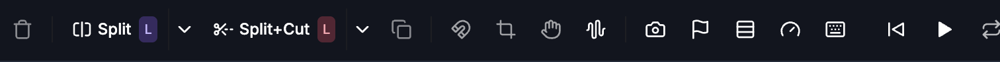
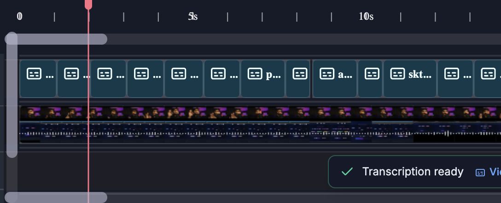
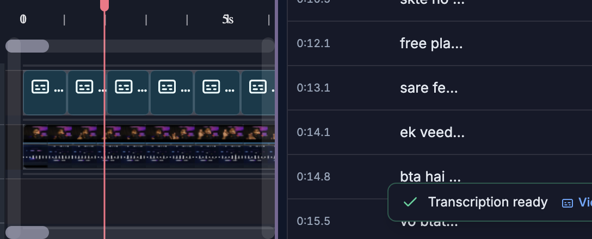

# Timeline & Selection

> **For humans — and for AI helping humans.** This document describes how a person edits video by
> hand using the on-screen controls of the SkillTown video editor. It is **not** an AI skill or an
> automation API, so if you are an AI agent, do **not** treat these steps as callable commands — for
> programmatic/automated editing use the agent skills and commands documented elsewhere (see
> `_Agent/AGENTS.md`). **You may, however, read this doc to answer a user's "how do I…" questions
> and walk them, step by step, through performing these actions themselves in the editor UI.**

> Use the timeline to read your edit, select clips, move them together, trim timing, split cuts, manage tracks, add transitions, place markers, and copy or paste timeline items.

## Where to find it

The **timeline** is the horizontal strip at the bottom of the editor, under the canvas/player. It contains the timeline toolbar, time ruler, pink playhead, track lanes, clip blocks, track controls, scrollbars, markers, keyframe diamonds, transitions, waveforms, and edit overlays.

Use the timeline directly with your mouse, trackpad, and keyboard. Click **Keyboard shortcuts (?)** in the timeline toolbar to view or change shortcuts; the dialog is titled **Keyboard shortcuts** and includes **Search shortcuts…**, **Change shortcut**, **Save**, **Replace**, and **Reset to default**.

## What you can do

- Read your edit using the ruler, playhead, current time, total duration, tracks, markers, waveforms, keyframes, transitions, and deletion overlays.
- Use every timeline toolbar control: delete, split, split-cut, clone, magnetic snapping, crop mode, pan mode, waveforms, freeze frame, markers, track size, playback feel, shortcuts, playback/loop, current time, duration, master volume, and zoom.
- Select one clip, add/remove individual clips from the selection, select a range, select all items, select a track’s items, select clips to the right on a track, or box-select clips.
- Drag one selected clip or move multiple selected clips together while preserving their spacing.
- Trim clip edges by dragging handles, or trim selected clips to the playhead with shortcuts.
- Use **Split** and **Split+Cut** at the playhead with selectable split modes.
- Delete, ripple delete, duplicate, copy, cut, and paste timeline items.
- Add and edit timeline transitions with the **Transition** picker.
- Drag clips across tracks, drop into gaps to create new tracks, reorder tracks, resize track rows, and delete tracks.
- Turn magnetic snapping on/off, zoom the timeline, scroll around long edits, and jump back to the playhead.

## How to use the timeline toolbar

The timeline toolbar runs across the top of the timeline. Controls are grouped from left to right: clip actions, split tools, timeline toggles, view tools, playback/time, master volume, and zoom.

| Toolbar control | Exact label or tooltip | What it does |
|---|---|---|
| Delete button | **Delete selected clip(s) (Del / Backspace)** / **Select a clip to delete** | Deletes selected editable clips. Locked tracks are protected. |
| **Split** | **Split at playhead — Select Both**, **Split at playhead — Select Right**, or **Split at playhead — Select Left** | Splits selected clips at the playhead using the current split selection mode. |
| Split mode menu | **Choose split selection mode** | Opens **Split Selection Mode** with **Select Both**, **Select Right**, and **Select Left**. |
| **Split+Cut** | **Split + Cut at playhead — Keep Left** or **Split + Cut at playhead — Keep Right** | Splits selected clips at the playhead and immediately deletes one side. |
| Split+Cut mode menu | **Choose split + cut mode** | Opens **Split + Cut Mode** with **Keep Left** and **Keep Right**. |
| Clone button | **Clone selected clip(s)** / **Select a clip to clone** | Duplicates selected clips. |
| Magnet button | **Magnetic snapping: ON — click to disable** / **Magnetic snapping: OFF — click to enable** | Turns snapping on or off for timeline drags and trims. |
| Crop button | **Crop mode: ON — drag handles will crop. Click to disable.** / **Crop mode: OFF — click to enable (or hold Alt while dragging)** | Changes edge-handle behavior for visual media so handles crop instead of trimming/resizing duration. |
| Hand button | **Pan mode: ON — drag the player to pan when zoomed in. Click to disable. (Ctrl+Space)** / **Pan mode: OFF — click to enable, then drag the player to pan when zoomed in. (Ctrl+Space · Ctrl+scroll = zoom · plain scroll = pan · Ctrl+0 = reset)** | Controls canvas/player panning when the preview is zoomed. |
| Waveform button | **Waveforms on video clips: ON — click to hide** / **Waveforms on video clips: OFF — click to show** | Shows or hides audio waveforms on video clips globally. |
| Freeze-frame button | **Freeze frame — insert still image at playhead (Shift+F)** | Inserts a still image from the current frame at the playhead. |
| Marker button | **Add marker at playhead (Shift+M)** | Adds a marker on the ruler at the playhead. |
| Track size button | **Track size: [size]** and **Click to change** | Opens **Track Size** with **Small**, **Normal**, **Large**, and **X-Large**. |
| Playback feel button | **Playback feel — arrow-key acceleration** | Opens **Playback feel** controls for held-arrow scrubbing. |
| Shortcuts button | **Keyboard shortcuts (?)** | Opens the keyboard shortcut dialog. |
| Loop button | **Loop playback (on)** / **Loop playback (off)** | Toggles looping playback. |
| Master volume button | **Mute** / **Unmute** | Mutes or unmutes all timeline audio without changing individual clip volumes. |
| Master volume slider | Percentage display, such as **100%** | Sets overall timeline playback volume from 0% to 100%. |
| Current-time field | Current timecode, such as `00:12.345` | Click to type a precise playhead time. Press Enter to apply or Escape to cancel. |
| Duration display | Full project duration beside the `|` divider | Shows the total timeline duration. |
| Jump-to-playhead button | **Jump to playhead** | Appears after you manually scroll away from the playhead; re-centers the playhead and resumes follow. |
| Zoom controls | Zoom-out icon, zoom slider, zoom-in icon, and fit icon | Changes timeline scale. The matching shortcut labels are **Zoom timeline out**, **Zoom timeline in**, and **Zoom to fit all content**. |

The toolbar does not show separate undo/redo buttons. Use the keyboard shortcuts **Undo** and **Redo** from **Keyboard shortcuts**.

## How to read the timeline

1. Look at the ruler at the top of the timeline.
   - The tick labels show timeline time at the current zoom level.
   - Click the ruler to seek the playhead to that time.
   - Drag the ruler left or right to scroll through the edit.
   - Double-click the ruler to add a marker at that time.

2. Use the pink playhead to see the current frame.
   - Drag the playhead line or knob to scrub.
   - Click the current timecode in the toolbar to type a precise time, then press Enter. Press Escape to cancel.

3. Read the duration display beside the current time.
   - It shows current time, a divider, and the full project duration.

4. Read tracks from top to bottom.
   - Higher tracks visually sit above lower tracks in the final video.
   - Track rows can show clips, audio waveforms, disabled/muted clip badges, transition handles, keyframe diamonds, and overlays.

5. Use markers and overlays.
   - **Add marker at playhead (Shift+M)** adds a marker on the ruler.
   - Double-click the ruler to add a marker at that time.
   - Click a marker to seek to it.
   - Right-click a marker to open **Edit marker label (leave blank to delete):**.
   - Keyframe diamonds show **Keyframe at frame [number] - Click to seek**.
   - Deleted transcript ranges can appear as **Applied deletion (removed from editor)** or **Pending deletion (not yet applied)**.

## How to zoom and scroll

1. Use the zoom controls at the right side of the toolbar.
   - **Zoom timeline out** reduces detail so more time fits on screen.
   - **Zoom timeline in** increases detail so short edits are easier to place.
   - **Zoom to fit all content** fits the whole edit into view.
   - Drag the zoom slider for continuous zoom changes.

2. Use shortcuts from **Keyboard shortcuts**.

   | Action label | Default shortcut |
   |---|---:|
   | **Zoom timeline in** | Mod+= |
   | **Zoom timeline out** | Mod+- |
   | **Zoom to fit all content** | Shift+Z |

3. Use the mouse or trackpad on the timeline.
   - Plain scroll moves through tracks vertically. If there is no vertical overflow, it scrolls through time.
   - Shift+scroll moves horizontally through time.
   - Ctrl/Command+scroll zooms around the cursor position.
   - Drag the top or bottom horizontal scrollbar to move through time.
   - Drag the left or right vertical scrollbar to move through tall track stacks.

4. If you manually scroll away during playback, click **Jump to playhead** to re-center and resume playhead follow.

## How to use playback and time controls

1. Use the center playback buttons to play, pause, loop, and move around the timeline.
2. Click the loop button to switch between **Loop playback (on)** and **Loop playback (off)**.
3. Click the current timecode to edit it.
   - Use `MM:SS.mmm` for shorter edits.
   - Use `H:MM:SS.mmm` for longer edits.
   - Press Enter to seek, or Escape to cancel.
4. Read the duration to the right of the divider to see the full project length.
5. Use the master volume control on the right.
   - Click **Mute** to mute all playback.
   - Click **Unmute** to restore playback.
   - Drag the slider to set the master volume percentage.

Playback shortcuts:

| Action label | Default shortcut |
|---|---:|
| **Play / Pause** | Space |
| **Play backward (J)** | J |
| **Pause (K)** | K |
| **Play forward (L)** | L |
| **Step 1 frame back** | ArrowLeft |
| **Step 1 frame forward** | ArrowRight |
| **Step 10 frames back** | Shift+ArrowLeft |
| **Step 10 frames forward** | Shift+ArrowRight |
| **Jump to start** | Home |
| **Jump to end** | End |
| **Toggle loop playback** | Shift+L |

## How to select one item

1. Click a clip in the timeline.
2. The selected clip receives a highlighted outline and trim handles appear when the item can be resized.
3. The properties panel updates for that clip.
4. Click empty timeline space to clear the selection, or press Escape for **Deselect all**.

If the clip is on a locked or hidden track, it cannot be selected or moved until the track is unlocked or shown.

## How to select multiple items

1. Ctrl-click or Command-click clips to add or remove individual clips from the selection.
2. Shift-click another clip to select the range between the last selected clip and the clicked clip.
3. Ctrl+Shift-click or Command+Shift-click to add a range to the current selection.
4. Drag a box/marquee over timeline clips to select multiple clips at once.
5. Use **Select all timeline items** to select every selectable timeline item.
6. Shift+Alt/Option-click in a track to select items on that track from that time to the right.

Useful selection shortcuts:

| Action label | Default shortcut |
|---|---:|
| **Select all timeline items** | Mod+A |
| **Deselect all** | Escape |
| **Select previous item on track** | Alt+ArrowLeft |
| **Select next item on track** | Alt+ArrowRight |

You can also use a track’s select button. Its tooltip changes between **Select all 1 item** or **Select all N items** and **Deselect all items**, and notes **(Ctrl+click to add)**.

## How to move items

1. Select one clip, then drag it left or right to change its time.
2. Drag it up or down to move it to another compatible track.
3. If the target time is open, the clip lands there.
4. If the target track would overlap another clip, the editor creates or uses a nearby compatible track instead of overwriting existing clips.
5. If a green drop preview appears in a valid gap, release to place the clip there. If the preview is red, that lane cannot accept the clip at that time.

To move multiple clips together:

1. Select all clips you want to move.
2. Drag any selected clip.
3. The whole selection moves together, keeping the spacing between selected clips.
4. If the group overlaps existing clips on the destination track, the moved group is kept together and placed on a new compatible track.

To duplicate by dragging, hold Alt/Option while dragging a selected clip or multi-selection. The original stays in place and the dragged copy lands where you release.

## How to use drag previews, gaps, and snapping

1. Watch the dashed drop preview while dragging a clip.
   - A green dashed rectangle means the clip can land there.
   - A red/orange dashed rectangle means the target track rejects that item type or the drop would overlap existing content.
2. If the editor finds a nearby open gap that fits the clip, the green preview may snap to that gap instead of staying exactly under the cursor.
3. If no usable gap exists on the target track, releasing the clip may place it on a new compatible track instead of overwriting existing clips.
4. When dragging a clip into the space above the first track, between tracks, or below the last track, a green horizontal insertion line means releasing there will create a new track at that boundary.
5. When a dragged edge aligns exactly with another clip edge, a vertical snap guide can appear to show the aligned edge.

Magnetic snapping controls whether clip edges snap to nearby clip edges and valid gaps:

1. Click the magnet button in the timeline toolbar.
2. The tooltip shows either **Magnetic snapping: ON — click to disable** or **Magnetic snapping: OFF — click to enable**.
3. Use **Toggle magnetic snapping** from **Keyboard shortcuts** when you prefer the keyboard.

| Action label | Default shortcut |
|---|---:|
| **Toggle magnetic snapping** | S |

## How to trim and resize clips

1. Select a clip once.
2. After it is selected, drag its left or right edge handle.
3. Drag the left edge to change the start.
4. Drag the right edge to change the end.
5. Release to commit the trim.

For video and audio clips, trimming changes which part of the source media is used. For visual/timeline-only items, resizing changes how long the item stays on the timeline. The trim is clamped so you cannot trim through neighboring clips on the same track.

Keyboard trim shortcuts:

| Action label | Default shortcut |
|---|---:|
| **Trim start of selected item(s) to playhead** | [ |
| **Trim end of selected item(s) to playhead** | ] |
| **Nudge selected items left by 1 frame** | , |
| **Nudge selected items right by 1 frame** | . |

## How to split, split-cut, and merge

1. Select the clip or clips you want to cut.
2. Move the playhead inside the selected clip range.
3. Click **Split** to cut at the playhead.
4. Use **Choose split selection mode** to open **Split Selection Mode**.
5. Pick one of the split selection results:

   | Mode | What it means |
   |---|---|
   | **Select Both** | Keep both new segments selected. |
   | **Select Right** | Select only the new right segment. |
   | **Select Left** | Keep only the left segment selected. |

6. Read the **Split** tooltip for the current mode. It includes **Hold Alt to split clicked track only**; while Alt is held, it changes to **Alt held: split clicked track only (skip linked tracks)**.
7. Click **Split+Cut** when you want to split and immediately delete one side.
8. Use **Choose split + cut mode** to open **Split + Cut Mode**.
9. Pick **Keep Left** or **Keep Right**.

Related shortcut labels:

| Action label | Default shortcut |
|---|---:|
| **Split at playhead (current mode)** | Q |
| **Split — keep Left segment selected** | A |
| **Split — keep Right segment selected** | R |
| **Split — keep Both segments selected** | B |
| **Split + cut at playhead (current cut mode)** | W |
| **Split + keep LEFT — delete right segment after split** | Shift+A |
| **Split + keep RIGHT — delete left segment after split** | Shift+R |
| **Blade — split ALL items at playhead** | Shift+B |
| **Merge adjacent split clips (rejoin)** | G |

If splitting fails, the editor explains whether the playhead is outside the clip or exactly on a clip edge. Move the playhead at least one frame inside the clip and try again.

## How to add and edit transitions

1. Put two compatible visual clips next to each other on the same track.
2. Click the transition handle between them to open the **Transition** picker.
3. Choose a transition preset.
4. Adjust **Duration** with the slider or one of the duration chips.
5. Click **Apply** to save the change.
6. Click **Remove** to remove the current transition, or choose **None** to remove it immediately.
7. Click **Close** or press Escape to close the picker.

Transition options:

| Option shown in the picker | Notes |
|---|---|
| **None** | Removes the transition. |
| **Fade** | Cross-fades between adjacent clips. |
| **Slide Up** | Slide transition with upward motion. |
| **Slide Down** | Slide transition with downward motion. |
| **Slide Left** | Slide transition with leftward motion. |
| **Slide Right** | Slide transition with rightward motion. |
| **Wipe Up** | Wipe transition with upward direction. |
| **Wipe Down** | Wipe transition with downward direction. |
| **Wipe Left** | Wipe transition with leftward direction. |
| **Wipe Right** | Wipe transition with rightward direction. |
| **Flip** | Flip-style transition. |
| **Clock Wipe** | Circular clock-like wipe. |
| **Star** | Star-shaped reveal. |
| **Circle** | Circular reveal. |
| **Rectangle** | Rectangular reveal. |

Duration controls:

| Control | Range or value |
|---|---:|
| **Duration** slider | 0.2s to 2.0s |
| Duration chip | 0.3s |
| Duration chip | 0.5s |
| Duration chip | 1.0s |
| Duration chip | 1.5s |

Transitions only work where the timeline has a valid transition handle between adjacent compatible clips.

## How to delete and ripple delete

1. Select one or more clips.
2. Click the delete button; its tooltip is **Delete selected clip(s) (Del / Backspace)**.
3. Or press the shortcut for **Delete selected items**.

Use **Ripple delete (close the gap)** when you want to remove selected clips and pull later clips on the same track left to close the empty space.

| Action label | Default shortcut |
|---|---:|
| **Delete selected items** | Delete / Backspace |
| **Ripple delete (close the gap)** | Shift+Delete / Shift+Backspace |

Locked tracks are skipped, so locked items are protected from delete and ripple delete.

## How to duplicate, copy, cut, and paste

1. Select the timeline items you want.
2. Use these shortcuts from **Keyboard shortcuts**:

   | Action label | Default shortcut |
   |---|---:|
   | **Duplicate selected items** | Mod+D |
   | **Copy selected items** | Mod+C |
   | **Cut selected items** | Mod+X |
   | **Paste (items or clipboard image/video)** | Mod+V |

3. Or click the toolbar clone button. Its tooltip is **Clone selected clip(s)** when clips are selected, and **Select a clip to clone** when nothing is selected.
4. Pasted timeline items keep their relative timing from the copied items and are selected after paste.
5. If the original track can accept the pasted items without conflict, they are placed there. Otherwise, the editor creates or uses a compatible track.

You can also paste image/video media from your system clipboard into the editor, unless your cursor is inside a text field.

## How to use track controls

Track controls sit to the left of each track lane. They affect the entire lane, not just one clip.

| Track control | Exact label or tooltip | What it does |
|---|---|---|
| Color dot | **Pick track color** / **Track color** | Opens color choices for the track. Color options include red, orange, yellow, green, cyan, blue, purple, and pink. |
| Broken media warning | **Media unavailable in this track** | Shows when a track contains media that cannot be loaded; use the popover to retry or relink media. |
| Visibility button | **Hide track** / **Show track** | Hides or shows all items on the track. Hidden tracks are not directly editable. |
| Mute button | **Mute track** / **Unmute track** | Mutes or unmutes audio-capable tracks. |
| Solo button | **Solo track (mute others)** / **Unsolo track** | Temporarily focuses one audio-capable track by muting the others. The inline solo button appears when solo is active. |
| Lock button | **Lock track (prevent edits)** / **Unlock track** | Prevents selection, movement, trim, resize, and delete edits on the track. |
| Select button | **Select all 1 item** / **Select all N items** / **Deselect all items** and **(Ctrl+click to add)** | Selects all items on the track, deselects them, or adds/removes them from the current selection. |
| Three-dot menu | Menu items listed below | Opens track management commands. |
| Reorder grip | **Drag to reorder track** | Drag vertically to move the track to a new position. |
| Row resize line | **Drag to resize the track above · double-click to reset** / **Drag to resize this track · double-click to reset** | Changes individual track-row height. Double-click resets the row height. |
| Panel resize handle | **Resize track controls panel** / **Drag to resize · double-click to auto-fit** | Changes the width of the left track-controls panel. Double-click auto-fits it. |
| Panel collapse button | **Collapse track controls** / **Expand track controls** | Collapses the track controls to a thin rail, or expands them again. |

The three-dot track menu can include:

| Menu item | What it does |
|---|---|
| **Rename track** | Turns the track name into an editable field labeled **Rename track**. Press Enter to commit or Escape to cancel. |
| **Solo track** / **Unsolo track** | Toggles solo for audio-capable tracks. |
| **Select all items (N)** / **Deselect all items** | Selects or deselects that track’s items. |
| **Track role: Default** | Sets the audio role to default. |
| **Track role: 🎤 Voice** | Marks the track as voice audio. |
| **Track role: 🎵 Music** | Marks the track as music audio. |
| **Move track up** | Moves the track one position up when possible. |
| **Move track down** | Moves the track one position down when possible. |
| **Link with...** | Opens available tracks to link with this track. |
| **No other tracks available** | Appears when there is nothing else to link. |
| **Unlink track** | Removes this track from its link. |
| **Unlink all** | Removes all tracks in the linked group from that group. |
| **Select for transcription** | Marks the track as the source for transcription. |
| **Show audio waveform** / **Hide audio waveform** | Shows or hides the waveform for that track when waveforms are globally enabled. |
| **Delete track** | Deletes the track and its items. |

## How to reorder and resize tracks

1. To reorder by drag, grab **Drag to reorder track** on the right edge of the track controls.
2. Drag the row up or down.
3. Watch the dashed highlight on the source lane and the bright horizontal line at the target boundary.
4. Release when the line is where you want the track to land.

You can also use **Move track up** and **Move track down** in the three-dot menu.

To resize track rows:

1. Hover near a track boundary.
2. Drag **Drag to resize the track above · double-click to reset** to resize the row above that boundary.
3. On the last row, drag **Drag to resize this track · double-click to reset** to resize that row.
4. Double-click the resize line to reset that track height.

To resize or collapse the track-controls panel:

1. Drag **Resize track controls panel** left or right.
2. Double-click **Drag to resize · double-click to auto-fit** to auto-fit the panel width.
3. Click **Collapse track controls** to hide most controls.
4. Click **Expand track controls** to show the controls again.

To add a new track, drag a clip between tracks, above the first track, or below the last track until the green horizontal line appears, then release. The editor creates a new compatible track at that position and moves the clip into it.

## How to use markers, keyframes, and deleted-range overlays

1. Add markers with **Add marker at playhead (Shift+M)** or by double-clicking the ruler.
2. Click a marker to seek to it.
3. Right-click a marker to edit its label in **Edit marker label (leave blank to delete):**.
4. Leave the marker label blank and confirm to delete that marker.
5. Click a keyframe diamond labeled **Keyframe at frame [number] - Click to seek** to seek to that keyframe, select the item, and open its properties.
6. Read deletion overlays when transcript edits are being previewed:
   - **Applied deletion (removed from editor)** is a grey overlay for a range already removed from the edit.
   - **Pending deletion (not yet applied)** is a red striped overlay for a range marked for deletion but not yet applied.

## How to change track display and playback feel

1. Click **Track size: [size]** to open **Track Size**.
2. Choose **Small**, **Normal**, **Large**, or **X-Large**.
3. Click **Waveforms on video clips: ON — click to hide** or **Waveforms on video clips: OFF — click to show** to show or hide video clip waveforms globally.
4. For an individual track, use **Show audio waveform** or **Hide audio waveform** in the track menu.
5. Click **Playback feel** to tune arrow-key scrubbing.
6. In **Playback feel**, use **Ramp speed**, **Max step (Arrow)**, and **Max step (Shift+Arrow)**.
7. The helper text says **Tap = 1 fr · hold = accelerate**.
8. Click **Reset** to restore the default playback feel.

## How to use keyboard shortcuts

1. Click **Keyboard shortcuts (?)** or press **?**.
2. The **Keyboard shortcuts** dialog opens.
3. Use **Search shortcuts…** to filter actions.
4. Click **Change shortcut** beside an action.
5. When it says **Press shortcut…**, press the new key combination.
6. Click **Save** to keep it.
7. If the shortcut conflicts, use **Replace** to confirm.
8. Click **Reset to default** to restore a single action’s default.

Complete timeline shortcut reference:

| Group | Action label | Default shortcut |
|---|---|---:|
| History & Selection | **Undo** | Mod+Z |
| History & Selection | **Redo** | Mod+Shift+Z |
| History & Selection | **Select all timeline items** | Mod+A |
| History & Selection | **Deselect all** | Escape |
| History & Selection | **Select previous item on track** | Alt+ArrowLeft |
| History & Selection | **Select next item on track** | Alt+ArrowRight |
| History & Selection | **Duplicate selected items** | Mod+D |
| History & Selection | **Copy selected items** | Mod+C |
| History & Selection | **Cut selected items** | Mod+X |
| History & Selection | **Paste (items or clipboard image/video)** | Mod+V |
| History & Selection | **Delete selected items** | Delete |
| History & Selection | **Ripple delete (close the gap)** | Shift+Delete |
| Playback | **Play / Pause** | Space |
| Playback | **Play backward (J)** | J |
| Playback | **Pause (K)** | K |
| Playback | **Play forward (L)** | L |
| Playback | **Step 1 frame back** | ArrowLeft |
| Playback | **Step 1 frame forward** | ArrowRight |
| Playback | **Step 10 frames back** | Shift+ArrowLeft |
| Playback | **Step 10 frames forward** | Shift+ArrowRight |
| Playback | **Jump to start** | Home |
| Playback | **Jump to end** | End |
| Playback | **Toggle loop playback** | Shift+L |
| Editing | **Split at playhead (current mode)** | Q |
| Editing | **Split — keep Left segment selected** | A |
| Editing | **Split — keep Right segment selected** | R |
| Editing | **Split — keep Both segments selected** | B |
| Editing | **Merge adjacent split clips (rejoin)** | G |
| Editing | **Split + cut at playhead (current cut mode)** | W |
| Editing | **Split + keep LEFT — delete right segment after split** | Shift+A |
| Editing | **Split + keep RIGHT — delete left segment after split** | Shift+R |
| Editing | **Blade — split ALL items at playhead** | Shift+B |
| Editing | **Trim start of selected item(s) to playhead** | [ |
| Editing | **Trim end of selected item(s) to playhead** | ] |
| Editing | **Nudge selected items left by 1 frame** | , |
| Editing | **Nudge selected items right by 1 frame** | . |
| Editing | **Toggle magnetic snapping** | S |
| Editing | **Mute / unmute track of selected item** | M |
| Editing | **Add marker at playhead** | Shift+M |
| Editing | **Freeze frame — insert still image at playhead** | Shift+F |
| Timeline & View | **Zoom timeline in** | Mod+= |
| Timeline & View | **Zoom timeline out** | Mod+- |
| Timeline & View | **Zoom to fit all content** | Shift+Z |
| Timeline & View | **Save project** | Mod+S |
| Help | **Open keyboard shortcuts dialog** | ? |

The footer says: **Tip: bindings are saved to this browser. Press ? anywhere to reopen.**

## Tips & good to know

- The top track is visually in front. Put text and captions above background video/image/scene tracks when you need them visible.
- The toolbar shows **Select a clip to delete** and **Select a clip to clone** when no clip is selected.
- **Split** and **Split+Cut** require the playhead to be inside the selected clip, not exactly on its start or end.
- Use Alt/Option while dragging to duplicate by drag. Use Shift+Alt/Option-click on a track area to select clips to the right on that track.
- Locked tracks protect items from timeline edits. Hidden tracks are also not directly editable.
- Empty tracks may disappear automatically after their last item is moved or deleted.
- Paste preserves copied item timing; use duplicate or drag after paste if you need a different position.
- If **Waveforms are disabled globally**, an individual track’s waveform menu item cannot turn them on by itself; turn global waveforms on first.
- If you scroll away from the playhead, **Jump to playhead** appears so you can re-center quickly.
- Track-row height and track-controls width are remembered for the project/browser until you reset or auto-fit them.

## Related

- [Overview & Navigation](01-overview-and-navigation.md)
- [Media Library](02-media-library.md)
- [Text & Captions](05-text-and-captions.md)
