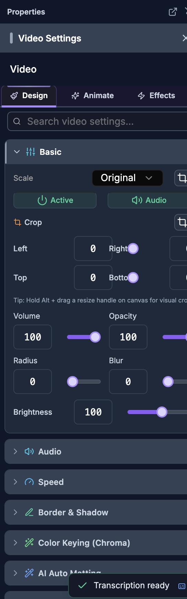
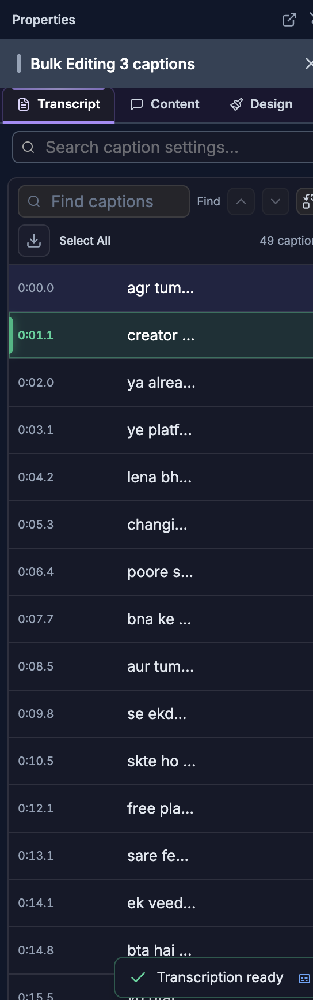

# Item Properties

> **For humans — and for AI helping humans.** This document describes how a person edits video by
> hand using the on-screen controls of the SkillTown video editor. It is **not** an AI skill or an
> automation API, so if you are an AI agent, do **not** treat these steps as callable commands — for
> programmatic/automated editing use the agent skills and commands documented elsewhere (see
> `_Agent/AGENTS.md`). **You may, however, read this doc to answer a user's "how do I…" questions
> and walk them, step by step, through performing these actions themselves in the editor UI.**

> The properties panel is the right-hand panel that appears whenever you select an item. It gives you every layout, appearance, media, audio, effect, camera, and layer control for that item, grouped into tabs and collapsible sections.

## Where to find it

1. Select an item on the canvas or in the timeline.
2. The right-hand **properties panel** opens automatically. Its header shows **Properties** (or **Tools** while other tool panels are open) plus a title that changes with the selected item type.
3. If nothing is selected, the panel shows **No item selected**.

### Panel title by item type

| Selected item | Panel title |
|---|---|
| Caption | **Caption Settings** |
| Text | **Text Settings** |
| Image | **Image Settings** |
| Video | **Video Settings** |
| Audio | **Audio Settings** |
| Shape | **Shape Settings** |
| Progress bar | **Progress Bar Settings** |
| Progress frame | **Progress Frame Settings** |
| Audio-bar visualizers | **Lineal Bars Settings**, **Wave Bars Settings**, **Hill Bars Settings**, or **Radial Bars Settings** |
| Template / scene | **Template Settings** |
| Nested scene | **Nested Scene (n layers)** |
| Anything else | **Item Settings** |

When several items of the **same** type are selected, the header shows a bulk title such as **Bulk Editing 3 images**, with in-panel indicators like **Images (3 selected)** or **Editing all 3 images**. When you select **mixed** item types, the header shows **3 Mixed Items** and the panel offers only the shared controls.

### Managing the panel window

The panel header has controls for how the panel is shown:

| Button / tooltip | What it does |
|---|---|
| **Pop out to separate window** | Moves the properties panel into its own floating OS window. |
| **Bring popout to front** | Raises the popped-out window above other windows. |
| **Dock panel back** / **Pin panel back** | Returns a floating or popped-out panel to the right side. |
| **Undock panel (make floating)** | Detaches the panel so you can drag it anywhere over the editor. |
| **Expand panel** / **Collapse panel** | Widens or narrows the panel. |
| **Drag to resize** | Drag the panel's inner edge to change its width. |
| **Close panel** | Closes the properties panel. |

An **AI Editor** side panel is available too, opened with **Open AI Editor** and managed with **Dock**, **Float**, **Close**, **Close AI Editor**, and **Collapse AI Editor**. It shows **Loading AI...** while it starts.

## What you can do

- Switch between the panel **tabs** for the selected item (Design, Animate, Effects, Camera, Auto-Captions, Basic, Content, Settings, Transcript — the set depends on item type).
- Search the panel with the per-item search box (for example **Search image settings...**).
- Expand or collapse each section by clicking its heading.
- Align, distribute, position, scale, and rotate items.
- Adjust common appearance: **Opacity**, **Rounded** corners, **Blur**, **Brightness**, flip, border/stroke, and shadow.
- Set image/video **Scale** to **Fill**, **Fit**, **Original**, or **Custom**; crop with numeric edges or the visual **Crop** dialog.
- Control clip playback: **Volume**, **Speed** / **Playback rate**, and **Reverse**; turn a clip **Active/Off** or **Audio/Muted**.
- Apply **Clip Mask** shapes, **Blend Mode**, **Color & Filters** grading, **Remove Background** / **Color Keying (Chroma)**, **AI Auto Matting**, **3D Camera**, **Zoom to Spot**, and **Face Track**.
- Style shapes, text, captions, progress bars/frames, and templates with type-specific controls.
- Edit nested-scene layers, and use floating pickers for **Fonts**, **Presets**, and **Animations**.
- Remove all motion with **Reset All**.

## How to open and navigate the properties panel

1. Click a single item on the canvas or timeline.
2. Click a **tab** at the top of the panel. The available tabs depend on the item type:

| Item type | Tabs |
|---|---|
| Image | **Design**, **Animate**, **Effects**, **Camera** |
| Video | **Design**, **Animate**, **Effects**, **Camera**, **Auto-Captions** |
| Shape | **Design**, **Effects** |
| Text | **Design**, **Animate**, **Effects** |
| Caption | **Transcript**, **Content**, **Design**, **Animate**, **Effects** |
| Audio | **Basic**, **Effects**, **Auto-Captions** |
| Template / scene | **Content**, **Settings**, **Effects** |
| Progress bar / frame | **Design**, **Effects** |

3. Use the search box to jump to a control by name. Each item type has its own placeholder: **Search image settings...**, **Search video settings...**, **Search text settings...**, **Search caption settings...**, **Search audio settings...**, or the generic **Search settings...**. You can search by common terms such as *volume, opacity, blur, brightness, border radius, scale, fit, gain, meter, eq, playback rate, reverse, keyframe, easing, chroma, blend, saturation, camera, focus point, face tracking, font, letter spacing, caption style, fade in, fade out, gradient, change shape,* and many more.
4. Open or close a section by clicking its heading (for example **Basic**, **Border & Shadow**, **Color & Filters**, **Speed**, **Keyframes**). Section open/closed states are remembered.

## How to align and distribute items

The **Align** toolbar appears at the top of the panel for supported visual items. Its heading reads **Align** for one item or **Align (n items)** for a selection.

| Control (tooltip) | What it does |
|---|---|
| **Align left to canvas** / **Align left to selection** | Moves the item to the left edge of the canvas, or aligns the selection's left edges. |
| **Center horizontally** | Centers horizontally. |
| **Align right to canvas** / **Align right to selection** | Right edge of canvas or selection. |
| **Align top to canvas** / **Align top to selection** | Top edge of canvas or selection. |
| **Center vertically** | Centers vertically. |
| **Align bottom to canvas** / **Align bottom to selection** | Bottom edge of canvas or selection. |
| **Distribute horizontally** | Spaces selected items evenly left-to-right. |
| **Distribute vertically** | Spaces selected items evenly top-to-bottom. |
| **Need 3+ items** | Tooltip shown when distribute is unavailable (fewer than three items selected). |

Whether the target is the canvas or the selection changes automatically based on how many items are selected.

## How to adjust common transform and appearance controls

These controls recur across most visual item types (exact labels below are the on-screen text).

| Control | Label / units | What it does |
|---|---|---|
| Opacity | **Opacity**, shown in **%** | Changes transparency. |
| Corner radius | **Rounded**, in **px** (also **Radius** in some panels) | Rounds the item's corners. |
| Blur | **Blur**, in **px** | Softens the item. |
| Brightness | **Brightness**, in **%** | Darkens or brightens the item. |
| Flip | **Flip**, with **Flip X** and **Flip Y** | Mirrors horizontally or vertically. |
| Scale | **Scale** | Resizes without changing the source dimensions. |
| Rotation | **Rotate** / **Rotation** | Rotates the item. |
| Lock ratio | **Lock Ratio** with **Yes** / **No** | Keeps width and height proportional while resizing. |

Number controls have both a slider and a typed value; drag the slider or type a number. You can also drag an item on the canvas to move it, and use its canvas handles to resize or rotate.

## How to edit image properties

Select an image. The panel title is **Image Settings** (bulk: **Images (n selected)** / **Editing all n images**).

**Design tab**

| Section | Controls |
|---|---|
| **Style Template** | Pick a motion/style preset; see the animation options below. |
| **Entry Animation** / **Exit Animation** | Choose how the image enters and leaves; **None** to clear. |
| **Basic** | **Scale** (**Fill**, **Fit**, **Original**), **Crop**, **Opacity**, **Radius**, **Blur**, **Brightness**. |
| **Border & Shadow** | **Border** and **Shadow** controls (color, size, X, Y, blur). |
| **Clip Mask** | Mask the image to a shape (see Clip Mask below). |
| **Remove Background** | Chroma/background removal controls. |
| **Blend Mode** | How the image blends with layers beneath it. |
| **Color & Filters** | Color-grade presets and adjustments. |
| **Reset All** | Remove all keyframes, effects, and animations. |

**Animate tab** — **Style Template**, **Entry Animation**, **Exit Animation**, and **Animations**.

**Effects tab** — **Keyframes**, **Effects**, **Clip Mask**, **Remove Background**, **Blend Mode**, **Color & Filters**, **Reset All**.

**Camera tab** — **3D Camera** and **Zoom to Spot**.

## How to edit video properties

Select a video. The panel title is **Video Settings**.

**Design tab**

| Section | Controls |
|---|---|
| **Basic** | **Scale** (**Fill**, **Fit**, **Original**, **Custom**), **Crop**, clip toggle **Active/Off**, audio toggle **Audio/Muted**, **Volume**, **Opacity**, **Radius**, **Blur**, **Brightness**. |
| **Audio** | Expanded audio controls for the clip's sound. |
| **Speed** | Playback speed (see the Speed table below). |
| **Animations** | Enter/exit and looping motion. |
| **Border & Shadow** | Border and shadow styling. |
| **Color & Filters** | Color grading. |
| **3D Camera** / **Zoom to Spot** | Camera motion. |
| **Face Track** | Auto-follow a speaker's face. |

The clip and audio toggles show helpful tooltips: **Clip is OFF — invisible & silent in preview/export. Click to turn it back on.**, **Clip is active. Click to turn it off (invisible + silent).**, **Audio is muted. Click to unmute this clip.**, and **Audio is on. Click to mute this clip.**

**Animate tab** — **Animations**.

**Effects tab** — **Keyframes**, **Effects**, **Clip Mask**, **Color Keying (Chroma)**, **AI Auto Matting**, **Blend Mode**, **Color & Filters**.

**Camera tab** — **3D Camera** and **Zoom to Spot**.

**Auto-Captions tab** — generate captions from the clip. If unavailable it shows **Transcription is unavailable for this clip.** Caption styling is covered in [Text and Captions](05-text-and-captions.md).

### Speed controls (video and audio)

| Control | What it does |
|---|---|
| **Playback rate** | Shows the current speed; tip: **Controls clip playback speed.** |
| **0.25x**, **0.5x**, **0.75x**, **1x**, **1.5x**, **2x**, **3x**, **4x** | Preset speeds. |
| **Custom** | Fine-tune the speed. |
| **Reverse** | **Play the selected clip backward.** |

## How to edit audio properties

Select an audio item. The panel title is **Audio Settings**.

**Basic tab**

| Section / control | What it does |
|---|---|
| **Source** | Shows the audio file; **Copy full path** copies the source path. If none, shows **No audio source available.** |
| **Volume** | Adjusts level (audio items allow boosted values above 100%). |
| Clip toggle | **Active** / **Off** includes or excludes the clip. |
| Audio toggle | **Audio** / **Muted** mutes or unmutes. |
| **Track role (auto-duck)** | **Default**, **Voice**, or **Music** — controls automatic ducking. |
| **Audio Processing** | Opens processing controls (gain, EQ, and related tools). Includes **Open master bus controls** for the master bus. |
| **Live meter** | Real-time L/R levels. Toggle with **Enable live meter** / **Disable live meter (saves CPU)**. Shows **(paused)** when playback is stopped. |
| **Loudness** | Analysis values **Peak**, **RMS**, **source**, and **after volume**. Shows **analyzing…**, **No audio source.**, or **Couldn't analyze (silent track or unsupported codec).** as needed. |
| **Speed** | Playback speed presets, **Custom**, and **Reverse** (same as video). |

The **Gain** fader shows a decibel scale (**−∞ dB** at the bottom). Tip: **Drag to adjust · double-click for 0 dB.**

**Effects tab** — **Animations**, **Effects**, **Keyframes**.

**Auto-Captions tab** — generate captions from the audio.

## How to edit shape properties

Select a shape. The panel uses the **Design** and **Effects** tabs.

**Design tab**

| Section / control | What it does |
|---|---|
| **Fill Color** | Changes the shape fill (solid or gradient). |
| **Stroke** | Border/stroke controls: **Stroke Color** and **Stroke Width**. |
| **Appearance** | **Opacity**, **Blur**, and **Brightness**. |
| **Size** | **Width** and **Height** inputs. |
| **Shadow** | Shadow **Color**, **X**, **Y**, and **Blur**. |
| **Change Shape** | Swap the current shape for another shape thumbnail. |

**Effects tab** — **Keyframes**.

## How to edit text properties

Select a text item. The panel uses **Design**, **Animate**, and **Effects** tabs.

**Design tab**

- **Text Style** — the main typography section, with **Reset Style** to restore defaults. Controls include **Styles** (font family), **Size**, **Typography**, **Line Height**, **Letter Spacing**, **Word Spacing**, **Border Radius**, **Rotation**, **Weight**, **Decoration**, and **Case** (**As typed**, **Uppercase**, **Lowercase**). Alignment offers **Left**, **Center**, **Right**. **Blend Mode** and **Background Color** are also here.
- **Fill** — choose a solid **Color** or turn on **Gradient** (tip: **Use a text gradient instead of a solid color**) and set **Color 1**, **Color 2**, and **Direction**. **Padding** offers **Top**, **Right**, **Bottom**, and **Left**.
- **Stroke & Shadow** — add outline and shadow. Use **Add Shadow** (under **Extra Shadows**, listed as **Shadow 1**, **Shadow 2**, …) and **Add Stroke** (under **Extra Strokes**, listed as **Stroke 1**, **Stroke 2**, …).
- **Word Colors** — **Pick colors for individual words.** Use **Reset All** to clear. If there is no text yet it shows **Add some text to style words.**

**Animate tab** — **Animations**.

**Effects tab** — **Keyframes** and **Effects**.

## How to edit caption properties

Select a caption. The panel uses **Transcript**, **Content**, **Design**, **Animate**, and **Effects** tabs.

| Tab | Contents |
|---|---|
| **Transcript** | The caption transcript editor, for correcting words and timing. |
| **Content** | **Preset** (choose a caption style), **Caption Words**, and **Caption Colors**. |
| **Design** | **Text Style** and **Stroke & Shadow**, as for text. |
| **Animate** | **Animations**. |
| **Effects** | **Keyframes** and **Effects**. |

If a caption has no words yet, the panel shows **No caption text yet** and **This caption has no words. Add captions to get started.** Caption styling and word editing are documented in [Text and Captions](05-text-and-captions.md).

## How to edit template (scene) properties

Select a template scene. The panel title is **Template Settings** and it uses the **Content**, **Settings**, and **Effects** tabs. Use the **Code** button (**View & fork source code**) to open the scene's source.

### Content tab

**Scene Orientation** sets the canvas for the scene:

| Control | Options |
|---|---|
| Orientation | **Landscape**, **Portrait** |
| Size presets | **1080p**, **720p**, **Square**, **4:5**, **9:16** |
| Custom size | **Width**, **Height** |
| **Speed** | Playback speed (title: **Playback speed**). |
| **Opacity** | Scene opacity, in **%**. |
| **Reset** | Restores orientation defaults. |

**Live Preview** shows a live render of the scene. Use **Float** / **Dock** to detach it (**Undock preview (float freely)** / **Dock preview back**); when floating it says **Preview is floating — drag it anywhere on screen** and **Click here to dock back**.

**Content** — the scene's own fields, taken from that template's schema. Field labels vary by template; each field type is edited differently:

| Field type | How you edit it |
|---|---|
| Text | A text box; required fields are marked with **\***. |
| Number | A number box with a slider. |
| Boolean | A toggle switch. |
| Color | A color swatch that opens a picker (**Click to pick color**), a hex box (**#000000**), a transparent toggle (**Set to opaque** / **Set to transparent**), and **Close color picker**. |
| List of text (tags) | Type into **Add item...** and press add; each tag has a remove button; a count shows **n items**. |
| List of numbers | **Add** and **Remove last** buttons. |
| List of objects | Rows labeled **Item 1**, **Item 2**, … each expanding to a sub-form. |
| Choice / enum | A dropdown with placeholder **Select...** |
| Range | Two or three linked sliders labeled **Start** → **End**, or **Start** → **Peak** → **End**. |
| Media | A media picker (see below). Grouped under **Media**. |
| Camera fields | Grouped under **Camera**. |

**Style Overrides** — style fields grouped under **Effects**, **Typography**, **Theme Colors**, and **Layout**. Advanced users can open **Raw JSON (advanced)** to edit the style JSON directly.

For deep editing you can open the full JSON editor (**Scene Props — <scene name>**, with **Format**, **Copy**, **Apply & Close**, **Cancel**, and a **Live Preview** that shows **Invalid JSON**/**Synced**), or the scene code editor (**Custom Scene Code**, **Bundled Scene Code**, or **Scene Source Code**).

### Settings tab

| Section | Controls |
|---|---|
| **Background & Effects** | **Background** color, **Gradient** intensity, and **Vignette** strength. |
| **Size & Crop** | **W** / **H**; size presets **Full**, **Half**, **Square**, **Wide**, **Banner**; **Layout Presets** (**Full**, **Top Half**, **Bottom Half**, **Left Half**, **Right Half**, **Top Left ¼**, **Top Right ¼**, **Bottom Left ¼**, **Bottom Right ¼**, **Center Card**, **Top ⅓**, **Middle ⅓**, **Bottom ⅓**); **Crop Edges** (**Left**, **Right**, **Top**, **Bottom**) with **Reset**, **Center 50%**, and **Top Half** quick actions. |
| **Video Settings** | For video-based scenes: **Volume**, **Speed**, **Blur**, **Brightness**, **Radius**, plus an **Audio** subsection. |
| **All Props (JSON)** | Inline JSON editor with **Apply**/**Saved**, **Copy**, and **Expand** (**Open in full editor**). |
| **Animations** | Scene **Enter** and **Exit** motion, with frame durations (**fr**) and quick presets **Fade In/Out**, **Slide Up**, **Scale In**, and **None**. Full options: **None**, **Fade**, **Slide Up**, **Slide Down**, **Slide Left**, **Slide Right**, **Scale**. |

### Effects tab

**Effects**, **Keyframes**, and (where supported) **3D Camera** and **Zoom to Spot**.

## How to edit progress bars and progress frames

Select a progress item (**Progress Bar Settings** or **Progress Frame Settings**). Tabs are **Design** and **Effects**.

**Design tab**

| Section | Controls |
|---|---|
| **Style** | Progress-bar styles **Solid**, **Segmented**, **Gradient**, **Glow**, **Striped**, **Outline**, **Dual**; progress-frame styles **Corner**, **Full Border**. Style-specific extras: **Segments** and **Gap** (Segmented), **Border** (Outline), **Gradient End** (Gradient). |
| **Colors** | **Progress Color** and **Track Color**. |
| **Settings** | **Inverted** toggle, **Height** (bars), **Direction** (**Horizontal** / **Vertical**, bars), **Thickness** (frames), **Flip X** / **Flip Y** (frames), plus **Radius**, **Opacity**, **Blur**, and **Brightness** where applicable. |
| **Quick Presets** | One-tap color presets: **Pink**, **Blue**, **Green**, **Purple**, **Orange**, **Red**, **Yellow**, **Teal**, **Indigo**, **Rose**, **Lime**, **White**. |

**Effects tab** — **Animations**.

## How to edit nested scene layers

A nested scene groups several items. Its panel title is **Nested Scene (n layers)**.

| Control | What it does |
|---|---|
| **Uncombine** | Breaks the nested scene back into separate items (confirms **Ungrouped n items**; shows **Failed to uncombine** on error). |
| **Select All** | Selects every layer inside. |
| **Quick Edit** | Compact controls for the selected layer: **Position & Size**, **Opacity**, **Round**, and (for video layers) **Vol**, **Speed**, **Blur**, **Bright**. |
| **Full Settings** | Opens the full native settings for that layer's type. |
| Batch (multiple layers) | **Opacity (all)** and **Visibility** with **Show** / **Hide**. |

Use each layer row's arrow controls to reorder a layer, the eye control to show/hide it, and the trash control to delete it. You cannot remove the last layer — it shows **Can't remove last layer**.

## How to edit multiple mixed items

When you select different item types together, the header shows **n Mixed Items** and the panel offers shared controls only:

| Section / control | What it does |
|---|---|
| **Position (Relative)** | Nudge all selected items together. |
| **Move X** / **Move Y** | Step buttons **-10**, **-1**, **+1**, **+10**. |
| **Scale** | Resize all selected items. |
| **Rotation** | Rotate all selected items. |
| **Appearance** | Shared **Opacity**. |

## How to apply a clip mask

Open the **Clip Mask** section (image and video Effects/Design). Choose a mask shape:

**None**, **Circle**, **Rounded**, **Diamond**, **Hexagon**, **Star**, **Triangle**, **Pentagon**, **Octagon**, **Heart**, **Cross**, **Arrow**.

## How to set a blend mode

Open the **Blend Mode** section. Modes are grouped by effect:

| Group | Modes |
|---|---|
| Basic | **Normal** |
| Darken | **Darken**, **Multiply**, **Color Burn** |
| Lighten | **Lighten**, **Screen**, **Color Dodge** |
| Contrast | **Overlay**, **Hard Light**, **Soft Light** |
| Inversion | **Difference**, **Exclusion** |
| Component | **Hue**, **Saturation**, **Color**, **Luminosity** |

## How to color-grade with Color & Filters

Open **Color & Filters**. Pick a preset or adjust manually.

- **Presets**: **Cinematic**, **Vintage**, **B&W Film**, **Warm**, **Cool**, **Noir**, **Faded**, **Vivid**, **Sunset**, **Moody**, **Pastel**, **Teal & Orange**, **Dream**, **Hi Contrast**, **Matte**. Use **Reset** to clear.
- **Adjust** sliders: **Contrast**, **Saturation**, **Hue** (in **°**), **Sepia**, and **Grayscale** (in **%**).

## How to remove a background (Color Keying / Chroma)

Open **Remove Background** (image) or **Color Keying (Chroma)** (video).

| Control | What it does |
|---|---|
| **Remove Background** | Master toggle for keying. |
| **Key Colors (Max 5)** | Add up to five colors to knock out; each has **Remove this color**, and you can **Add another key color**. |
| **Eyedropper** | Pick a color from the video (shows **Picking…** while active). Quick presets set a green/blue/etc. **screen**. |
| **Tolerance**, **Edge Softness**, **Spill Removal** | Fine-tune the key; **Reset** restores defaults. |
| **Denoise (clean edges)** | Smooths edges (**Global — smooths chroma for all colors**). |

For automatic cutouts, open **AI Auto Matting**. It notes **Requires the Desktop app for local GPU processing.** and **Requires an AI model (~15MB) to be downloaded once to your device.** Use **Download AI Model** (shows **Downloading...**); once ready it shows **AI Matting Active (Local GPU)**.

## How to use the 3D Camera and Zoom to Spot

Open **3D Camera** (Camera/Effects tab). Turn it on with **Toggle 3D Camera on**, then **Pick a movement** from the presets and refine under **Your moves**:

Movement presets: **Orbit Right**, **Orbit Left**, **Tilt Up**, **Tilt Down**, **Push In**, **Pull Out**, **Dramatic**, **Hover**, **Ken Burns**, **Slide Right**, **Slide Left**, **Hold / Pause**. Apply modes **Replace** or **Append**. Fine controls cover **Scale**, **Rotation**, **Position**, and **Focus**, with **Reset**, **Undo**, and **Redo**.

Open **Zoom to Spot** to zoom into focus points. It hints **Toggle Zoom to Spot on (top right) to add focus points.**

## How to track a face (Face Track)

Open **Face Track** (video). It explains **Detect faces and auto-pan the crop window to follow the speaker.**

| Control | What it does |
|---|---|
| **Auto** / **Follow** | **Auto** splits when two faces are present; **Follow** pans to a single speaker. |
| **Sensitivity** | **Tight**, **Normal**, or **Loose**. |
| **Preview** | Toggles the on-canvas overlay (**Show face preview overlay** / **Hide face preview overlay**). |
| **Re-detect** / **Regen** | Re-runs detection. |
| **Remove** | Clears tracking. |

## How to add and tune animations

Open **Animations** (Animate/Effects tab). It has **In**, **Loop**, and **Out** tabs; each shows preset thumbnails plus **None**. When several items are selected with different settings it shows **Multiple**. Duration sliders are **Animation In Duration**, **Animation Out Duration**, and **Animation Loop Duration**.

**Entry Animation** / **Exit Animation** pickers let you choose a preset (or **None**), set **Start**, **End**, and **Duration (frames)**, choose an **Easing**, and open **Tweak Parameters** to adjust properties such as **Scale**, **Scale X**, **Scale Y**, **Opacity**, **Position X**, **Position Y**, **Rotation**, **Blur**, and **Brightness**. A **(modified)** badge appears when you change defaults; use **Reset to Defaults** or **Re-apply with current settings**.

Easing options include **Linear**, **Ease**, **Ease In**, **Ease Out**, **Ease In Out**, the Quad/Cubic variants, and **Back**, **Expo**, **Bounce**, and **Elastic** variants.

The **Style Template** section (images) applies a coordinated look and can add matching sound: toggle **Sound Effects** **ON**/**OFF** (**Auto-adds sound effects matching each animation preset.**), set **Stagger (frames between items)**, enable **Vary** (**Each image gets a different animation.**), and use **Copy** / **Paste to All** to share one animation across a selection.

## How to manage effects

Open **Effects**. Search with **Search effects...**. Applied effects appear under **Applied (n)** with **Disable**/**Enable** and **Delete** per effect. Effect parameters include **Timing** (**Start**, **End**), **Fade In**, **Fade Out**, **Easing**, and effect-specific values (**Intensity**, **Amount**, **Scale**, **Speed**, etc.).

## How to remove all motion (Reset All)

Open **Reset All**. It lists **Content to be removed:** with counts for **Keyframes**, **Effects**, and **Animations**. Click **Remove All Keyframes & Effects**; confirm **Remove All Keyframes & Effects?** with **Remove All** (or **Cancel**). This is undoable with Ctrl+Z.

## How to crop an image or video

1. Select an image or video.
2. In **Basic**, click **Crop** or **Visual crop editor**.
3. In the **Crop** dialog, choose **Aspect Ratio**: **Free**, **1:1**, **2:3**, **3:2**, **3:4**, **4:3**, **9:16**, or **16:9**.
4. Drag the crop box or its handles in the preview.
5. Click **Apply** to save, or **Reset** to restore the full image/video.

You can also use the numeric **Left**, **Right**, **Top**, and **Bottom** edge controls and **Reset crop** directly in the panel. The panel tip reads: **Tip: Hold Alt + drag a resize handle on canvas for visual crop**.

## How to pick or replace media (template fields)

Media fields use a picker with:

| Control | What it does |
|---|---|
| **URL or upload...** | Type/paste a URL. |
| **Upload file** | Upload a file from your device. |
| **Pick from timeline** / **Timeline Media** | Reuse media already on the timeline. |
| **Remove media** | Clears the field. |

## How to use on-canvas floating controls

Some pickers open as floating popovers on the canvas.

| Floating panel | What it does |
|---|---|
| **Fonts** | Search fonts with **Search font...** and apply one to the selected text. Shows **No font found** when there is no match. |
| **Presets** | Text or caption style presets. Text presets preview the word **Text**. In caption bulk mode the heading adds **Bulk (n)**, and a **Custom** entry is available. |
| **Animations** | Preset thumbnails under **In**, **Loop**, and **Out** tabs; the heading shows the count of affected items. |

Click outside the floating control or use its close icon to dismiss it.

The caption **Presets** picker also lets you preview against your footage: switch between **Words** and **Lines**, search with **Search presets...**, type your own text in **Preview with your own text...** (**Clear custom text** to reset), and change the preview background (**Dark**, **White**, **Gray**, **Green**, **Blue**, **Red**, or **Pick custom color**). If nothing matches it shows **No presets found**.

## How to arrange layers

1. For normal timeline items, set front-to-back order by moving items between tracks in the timeline — items on higher/front tracks render above those behind.
2. For selected visual items, use the **Align** controls to line them up.
3. For nested scenes, use each layer row's arrow controls to reorder, and **Show**/**Hide** (or the eye control) for visibility.
4. Use **Uncombine** to return nested layers to separate timeline items.

## Tips & good to know

- Not every item shows every section — the panel only shows controls that apply to the selected type.
- **Custom** appears in **Scale** only when the current scale is not **Fill**, **Fit**, or **Original**.
- **Distribute horizontally** / **Distribute vertically** need at least three selected items.
- Audio **Live meter** and video effects use extra CPU; **AI Auto Matting** needs the Desktop app and a one-time model download.
- Audio **Volume** can exceed 100% for boosting; the **Gain** fader shows the equivalent in decibels.
- Template **Content** fields are defined by each scene's schema, so their labels differ from template to template.
- **Auto-Captions**, caption words, and caption styling are documented in [Text and Captions](05-text-and-captions.md); detailed **Animations**/**Keyframes** workflows are covered in the animation manual.
- Section open/closed states and the last-used tab are remembered per item type.

## Related

- [Media Library](02-media-library.md)
- [Scenes, Templates, and Styles](03-scenes-templates-styles.md)
- [Text and Captions](05-text-and-captions.md)
