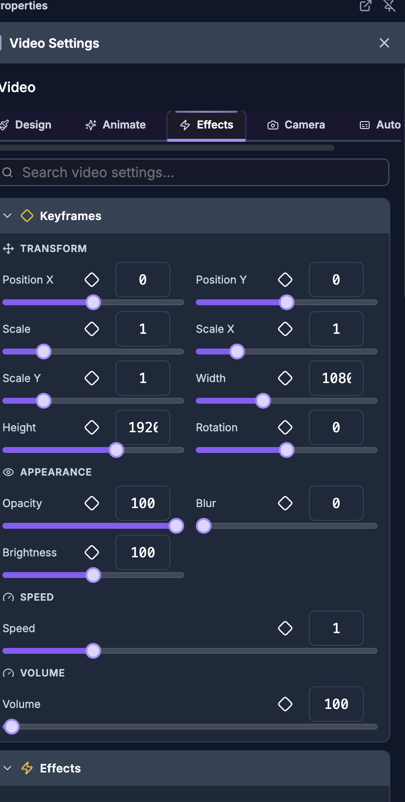

# Visual Effects, Filters, Chroma Key & Color

> **For humans — and for AI helping humans.** This document describes how a person edits video by
> hand using the on-screen controls of the SkillTown video editor. It is **not** an AI skill or an
> automation API, so if you are an AI agent, do **not** treat these steps as callable commands — for
> programmatic/automated editing use the agent skills and commands documented elsewhere (see
> `_Agent/AGENTS.md`). **You may, however, read this doc to answer a user's "how do I…" questions
> and walk them, step by step, through performing these actions themselves in the editor UI.**

> Add stylized effects, tune image/video color, remove green or blue screens, mask clips, blend layers, and choose exact solid or gradient colors.

## Where to find it

Select an image, video, text, caption, shape, audio item, or scene on the canvas or timeline to open the properties panel. Visual presets are in **Effects**. Images and videos also have **Basic**, **Border & Shadow**, **Clip Mask**, **Blend Mode**, and **Color & Filters** sections.

For images, open **Remove Background** for chroma key controls. For videos, open **Color Keying (Chroma)** or **AI Auto Matting**. Videos also include **Face Track** when you want the crop to follow faces.

Color pickers appear anywhere you click a color field, such as **Color**, **Fill**, **Background Color**, **Stroke Color**, **Shadow Color**, **Color 1**, or **Color 2**.

## What you can do

- Apply stackable visual presets from **Color**, **Visual**, **Glow & Shadow**, and **Motion** groups.
- Search presets with **Search effects...**, reuse **Recently Used**, and manage **Applied** effects.
- Time each applied effect with **Start**, **End**, **Fade In**, **Fade Out**, and **Easing**.
- Apply filter presets such as **Cinematic**, **Vintage**, **B&W Film**, **Warm**, **Cool**, and **Vivid**.
- Manually tune **Blur**, **Brightness**, **Contrast**, **Saturation**, **Hue**, **Sepia**, and **Grayscale**.
- Change layer interaction with **Blend Mode** options like **Multiply**, **Screen**, **Overlay**, and **Color Dodge**.
- Crop visible media into **Clip Mask** shapes such as **Circle**, **Diamond**, **Hexagon**, **Star**, and **Heart**.
- Remove backgrounds with **Remove Background**, **Color Keying (Chroma)**, or **AI Auto Matting**.
- Track faces in video with **Face Track**, **Auto**, **Follow**, **Sensitivity**, and **Preview**.
- Style images/videos with **Border & Shadow**, **Border**, **Shadow**, **Radius**, **Blur**, **Brightness**, and **Flip**.
- Pick colors with **Solid**, **Gradient**, **Hex**, opacity **%**, and **Pick color from screen**.

## How to apply visual effect presets

1. Select the item you want to stylize.
2. In the properties panel, open **Effects**.
3. Use **Search effects...** if you know the look you want. Search checks the preset name, description, and effect type. If nothing matches, the panel shows **No effects found for "{searchQuery}"**.
4. If you have used effects before, use **Recently Used** to reapply one of the last six presets.
5. Browse the preset groups and click a preset to apply it:

   | Group | Presets |
   |---|---|
   | **Color** | **Black & White**, **Desaturated**, **Noir**, **Vintage Sepia**, **Warm Tone**, **Retro Film**, **Negative**, **X-Ray**, **Hue Shift 90°**, **Hue Shift 180°**, **Hue Shift 270°**, **Rainbow Shift**, **Vivid Colors**, **Muted Colors**, **Color Pop**, **High Contrast**, **Low Contrast**, **Dramatic**, **Washed Out** |
   | **Visual** | **Soft Focus**, **Heavy Blur**, **Dreamy**, **Motion Blur**, **Flash**, **Dimmed**, **Blackout**, **Overexposed**, **Subtle Vignette**, **Dramatic Vignette**, **Spotlight**, **Light Grain**, **Heavy Grain**, **8mm Film** |
   | **Glow & Shadow** | **Soft Shadow**, **Hard Shadow**, **Long Shadow**, **Colored Shadow**, **White Glow**, **Neon Blue**, **Neon Pink**, **Neon Green**, **Neon Red**, **Neon Orange**, **Golden Glow**, **Soft Glow** |
   | **Motion** | **Light Shake**, **Heavy Shake**, **Earthquake**, **Slow Pulse**, **Fast Pulse**, **Breathing**, **Subtle Glitch**, **Heavy Glitch**, **VHS Tracking** |

6. After a preset is added, it appears under **Applied (1)**, **Applied (2)**, and so on.
7. Click an applied effect row to expand or collapse its detailed controls.
8. Use **Disable** to temporarily turn an effect off, **Enable** to turn it back on, or **Delete** to remove it.

## How to adjust an applied effect

1. Open **Effects** and expand an item under **Applied**.
2. Applied rows use the effect type label, so a preset may appear as **Grayscale**, **Sepia**, **Invert**, **Hue Rotate**, **Saturate**, **Contrast**, **Blur**, **Brightness**, **Vignette**, **Film Grain**, **Drop Shadow**, **Glow**, **Shake**, **Pulse**, or **Glitch**.
3. Under **Timing**, set **Start** and **End**. Values display in frames, such as `0f`; **End** shows `end` when the effect runs until the item finishes.
4. Under **Transitions**, set **Fade In** and **Fade Out**. Both use frames and can be set from 0 to 60 frames.
5. Choose **Easing** from the dropdown:

   | **Easing** options |
   |---|
   | **Linear**, **Ease**, **Ease In**, **Ease Out**, **Ease In Out**, **Ease In Quad**, **Ease Out Quad**, **Ease In Out Quad**, **Ease In Cubic**, **Ease Out Cubic**, **Ease In Out Cubic** |

6. Under **Parameters**, tune the controls shown for that effect:

   | Control | Appears for | What it changes |
   |---|---|---|
   | **Intensity** | Most effects | Overall strength, shown as a percentage. |
   | **Hue** | Hue shift effects | Color rotation in degrees. |
   | **Blur** | Shadow and glow effects | Softness of the shadow or glow in pixels. |
   | **Color** | Shadow and glow effects | The shadow or glow color. |
   | **Amount** | Shake effects | Shake distance in pixels. |
   | **Scale** | Pulse effects | Maximum pulse size as a percentage. |
   | **Speed** | Pulse effects | Pulse speed multiplier. |
   | **Frequency** | Glitch effects | How often the glitch appears. |
   | **Amplitude** | Glitch effects | Glitch offset strength in pixels. |

7. For entry/exit preset parameter controls elsewhere in the panel, the editable labels are **Scale**, **Scale X**, **Scale Y**, **Opacity**, **Position X**, **Position Y**, **Rotation**, **Blur**, and **Brightness**, with **Start**, **End**, **Duration (frames)**, **Easing**, and **Reset to Defaults**.

## How to use image and video filters

1. Select an image or video.
2. Open **Color & Filters**.
3. Under **Presets**, click a quick look:

   | Preset | Brightness | Contrast | Saturation | Hue | Sepia | Grayscale | Result |
   |---|---:|---:|---:|---:|---:|---:|---|
   | **Reset** | 100 | 100 | 100 | 0 | 0 | 0 | Neutral color. |
   | **Cinematic** | 95 | 120 | 85 | 0 | 10 | 0 | Lower saturation with stronger contrast. |
   | **Vintage** | 105 | 90 | 70 | -10 | 40 | 0 | Soft, warm retro color. |
   | **B&W Film** | 105 | 130 | 0 | 0 | 0 | 100 | High-contrast black-and-white. |
   | **Warm** | 105 | 105 | 120 | 10 | 20 | 0 | Warmer, more saturated color. |
   | **Cool** | 100 | 105 | 90 | -20 | 0 | 0 | Cooler color shift. |
   | **Noir** | 90 | 150 | 0 | 0 | 0 | 100 | Dark, high-contrast monochrome. |
   | **Faded** | 115 | 85 | 60 | 0 | 15 | 0 | Bright, low-contrast faded look. |
   | **Vivid** | 105 | 115 | 160 | 0 | 0 | 0 | Bright, saturated color. |
   | **Sunset** | 105 | 110 | 130 | 15 | 25 | 0 | Warm orange sunset tone. |
   | **Moody** | 85 | 125 | 70 | -5 | 5 | 0 | Darker, dramatic color. |
   | **Pastel** | 115 | 80 | 50 | 0 | 10 | 0 | Bright, soft, low-saturation look. |
   | **Teal & Orange** | 100 | 115 | 130 | -15 | 10 | 0 | Teal/orange-style grade. |
   | **Dream** | 115 | 90 | 80 | 5 | 20 | 0 | Bright, soft, warm look. |
   | **Hi Contrast** | 100 | 160 | 110 | 0 | 0 | 0 | Very strong contrast. |
   | **Matte** | 110 | 90 | 85 | 0 | 8 | 0 | Soft matte finish. |

4. Under **Adjust**, use the manual sliders:

   | Slider | Range shown | What it does |
   |---|---:|---|
   | **Contrast** | 0–200% | Reduces or increases separation between dark and light areas. |
   | **Saturation** | 0–200% | Removes color at low values or boosts color at high values. |
   | **Hue** | -180°–180° | Rotates all colors around the color wheel. |
   | **Sepia** | 0–100% | Adds a brown vintage tone. |
   | **Grayscale** | 0–100% | Converts the image or video toward black-and-white. |

5. For basic image/video tuning, open **Basic** and use:

   | Control | Range shown | Where it appears | What it does |
   |---|---:|---|---|
   | **Blur** | 0–100 | **Basic** | Softens the selected image or video. |
   | **Brightness** | 0–200 | **Basic** | Darkens below 100 or brightens above 100. |
   | **Opacity** | 0–100 | **Basic** | Makes the selected image or video more transparent. |
   | **Radius** | 0–100 | **Basic** | Rounds the corners of the selected image or video. |
   | **Rounded** | 0–100px | Other rounded-corner controls | Rounds corners where the control is labeled **Rounded**. |

## How to use blend modes

1. Select an image or video.
2. Open **Blend Mode**.
3. Choose a mode from the dropdown, or click one of the quick buttons shown in the grid.

| Group | Options |
|---|---|
| **Basic** | **Normal** |
| **Darken** | **Multiply**, **Darken**, **Color Burn** |
| **Lighten** | **Screen**, **Lighten**, **Color Dodge** |
| **Contrast** | **Overlay**, **Hard Light**, **Soft Light** |
| **Inversion** | **Difference**, **Exclusion** |
| **Component** | **Hue**, **Saturation**, **Color**, **Luminosity** |

Use **Normal** when you do not want the clip to blend with layers underneath it.

## How to mask an image or video into a shape

1. Select an image or video.
2. Open **Clip Mask**.
3. Click a mask preset. The selected item is clipped into that shape without changing the original media.

| **Clip Mask** options |
|---|
| **None**, **Circle**, **Rounded**, **Diamond**, **Hexagon**, **Star**, **Triangle**, **Pentagon**, **Octagon**, **Heart**, **Cross**, **Arrow** |

Choose **None** to remove the mask.

## How to remove a green screen or blue screen with chroma key

1. Select the image or video with the colored background.
2. For an image, open **Remove Background**. For a video, open **Color Keying (Chroma)**.
3. Turn on **Remove Background**.
4. Under **Key Colors (Max 5)**, choose the color to remove:
   - Click **Green** for a green screen.
   - Click **Blue** for a blue screen.
   - Click **+** to add another key color.
   - Click **Eyedropper** to sample a color from the preview. While active, it shows **Picking…**.
5. If the toggle is off, the panel reminds you: **Pick the backdrop color now, then toggle Remove Background on.**
6. Click a color swatch to expand that color’s controls. The color row shows the hex color and a compact readout like `T:45 E:20 S:35` for tolerance, edge softness, and spill removal.
7. Tune each key color separately:

   | Control | Default | Range | What it does |
   |---|---:|---:|---|
   | **Tolerance** | 45 | 0–100 | Expands or narrows the range of colors removed around the key color. Increase it when the backdrop remains visible. Decrease it if the subject starts disappearing. |
   | **Edge Softness** | 20 | 0–100 | Feathers the transparent edge. Increase it for smoother hair, fabric, or motion edges. |
   | **Spill Removal** | 35 | 0–100 | Reduces green/blue color reflected on the subject. Increase it if edges look tinted. |
   | **Reset** | — | — | Restores that color’s chroma settings to default values. |

8. Use **Denoise (clean edges)** if compressed footage leaves blocky or noisy edges. The note **Global — smooths chroma for all colors** means this one slider affects every key color.
9. If you added the wrong color, hover the swatch and use **Remove this color**.

## How to remove a video background with AI Auto Matting

1. Select a video.
2. Open **AI Auto Matting**.
3. Turn on **AI Auto Matting**.
4. If you are not using the desktop app, you may see **AI Auto Matting** with the message **Requires the Desktop app for local GPU processing.**
5. If the local model is not installed, the panel says **Requires an AI model (~15MB) to be downloaded once to your device.** Click **Download AI Model**.
6. During setup, the panel shows **Downloading...** and a percentage.
7. When the feature is on and ready, the status shows **AI Matting Active (Local GPU)**.

AI matting is separate from chroma key. Use chroma key for green/blue screens; use **AI Auto Matting** when the background is not a single key color.

## How to use Face Track on a video

1. Select a video.
2. Open **Face Track**.
3. Click **Auto** or **Follow**:

   | Button | What it does |
   |---|---|
   | **Auto** | Detects faces and can split if there are 2 faces. The helper text says **Auto** — split if 2 faces. |
   | **Follow** | Detects one speaker and pans the crop window to follow. The helper text says **Follow** — single pan. |

4. While detection runs, the section shows **Processing…**.
5. After face tracking is active, use the controls:

   | Control | What it does |
   |---|---|
   | **Preview** | Shows or hides the face preview overlay. The tooltip changes between **Show face preview overlay** and **Hide face preview overlay**. |
   | **Re-detect** | Runs detection again. Use **Auto** or **Follow** in this row to update the result. |
   | **Sensitivity** | Re-runs tracking with **Tight**, **Normal**, or **Loose**. |
   | **Regen** | Regenerates the tracking keyframes from the detected faces. |
   | **Remove** | Removes face tracking from the video. |

6. The active badge can show **Split (...)** for split layouts or **Follow** for a single following crop.

## How to add borders, shadows, radius, blur, brightness, and flip

1. Select an image or video.
2. Open **Basic** for quick appearance controls:

   | Control | What it changes |
   |---|---|
   | **Radius** | Rounds corners. |
   | **Blur** | Softens the whole image or video. |
   | **Brightness** | Darkens or brightens the whole image or video. |
   | **Opacity** | Changes transparency. |

3. Open **Border & Shadow** for outline and shadow styling:

   | Area | Controls |
   |---|---|
   | **Border** | **Color** and **Size**. In some border controls the width slider is labeled **Width**. |
   | **Shadow** | **Color**, **X**, **Y**, and **Blur**. |

4. Click the border or shadow **Color** field to open the color picker.
5. If the selected item exposes **Flip**, use **Flip X** to mirror horizontally or **Flip Y** to mirror vertically.

## How to use the color picker, gradients, and eyedropper

1. Click any visible color field, such as **Color**, **Fill**, **Stroke Color**, or **Shadow Color**.
2. If both modes are available, choose **Solid** for one color or **Gradient** for multiple color stops.
3. For a solid color:

   | Control | What to do |
   |---|---|
   | Color board | Drag inside the square color board to choose shade and brightness. |
   | Hue ribbon | Drag along the rainbow ribbon to change the base hue. |
   | Alpha ribbon / **%** | Set opacity. `100` is fully opaque; lower values are more transparent. |
   | **Hex** | Type a hex value and press Enter or click away. |
   | **Pick color from screen** | Click the eyedropper button, then sample any visible pixel. |

4. For a gradient:
   - Use the same board, **Hex**, **%**, and **Pick color from screen** controls to edit the active stop.
   - Click the gradient stop bar to add a stop when adding stops is available.
   - Drag stops to reposition them.
   - Double-click a stop to remove it.
   - Click the gradient mode control to switch between linear and radial styles.
   - Drag the angle handle to change the gradient direction for linear gradients.
   - For radial gradients, click one of the position points to move the center.
5. For text gradients, turn on **Gradient**, then set **Color 1**, **Color 2**, and **Direction**. The helper text says **Use a text gradient instead of a solid color**.

## Tips & good to know

- Effects can stack. For example, a color preset, a glow, and a motion effect can all be applied to the same item.
- **Recently Used** appears after you have applied effects before and is hidden while you are searching.
- **End** shows `end` when the effect runs until the item finishes.
- Chroma key supports up to five key colors, which helps with uneven screens, shadows, or mixed green/blue backgrounds.
- If chroma key removes parts of your subject, lower **Tolerance** before changing other settings.
- If the background is gone but the edge looks harsh, raise **Edge Softness** slightly.
- If the subject has a green or blue fringe, raise **Spill Removal**.
- Raise **Denoise (clean edges)** only as much as needed; high denoise can soften fine detail.
- Use **Reset** in **Color & Filters** before trying a new grade if you want to start from neutral.
- Use **Normal** in **Blend Mode** to return a layer to standard compositing.
- Use **None** in **Clip Mask** to remove shape clipping.
- Use **AI Auto Matting** for regular backgrounds and **Remove Background** / **Color Keying (Chroma)** for green or blue screens.

## Related

- [Timeline editing](02-timeline.md)
- [Text, captions, and typography](05-text-captions.md)
- [Images, video, and media](06-media.md)
- [Transitions and motion](08-transitions-motion.md)
