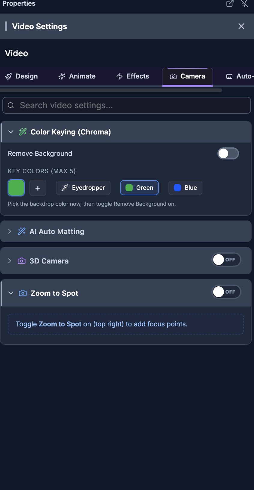

# Camera Effects

> **For humans — and for AI helping humans.** This document describes how a person edits video by
> hand using the on-screen controls of the SkillTown video editor. It is **not** an AI skill or an
> automation API, so if you are an AI agent, do **not** treat these steps as callable commands — for
> programmatic/automated editing use the agent skills and commands documented elsewhere (see
> `_Agent/AGENTS.md`). **You may, however, read this doc to answer a user's "how do I…" questions
> and walk them, step by step, through performing these actions themselves in the editor UI.**

> Add cinematic camera movement to a selected clip, including 3D zoom, pan, tilt, roll, focus-point zooms, and chained movement sequences.

## Where to find it

1. Select a supported video, image, or scene/template item on the canvas or timeline.
2. Open the properties panel for the selected item.
3. For video items, open the **Effects** tab, then use **3D Camera** or **Zoom to Spot**.
4. For image and scene/template items, look for the **3D Camera** and **Zoom to Spot** sections in the properties panel.
5. Turn on the switch in the section header. The switch shows **ON** when the effect is active and **OFF** when it is inactive.
6. If a section says **Toggle 3D Camera on (top right) to add camera moves.** or **Toggle Zoom to Spot on (top right) to add focus points.**, turn on the matching switch first.

## What you can do

- Use **3D Camera** to add preset movement such as **Orbit Right**, **Push In**, **Ken Burns**, slides, tilts, and hover moves.
- Use **Pick a movement preset** to quickly add a camera move, then refine it in **Your moves**.
- Use **Adjust** to tweak the current frame with a direct camera pad: drag to pan, scroll to zoom, and drag **Pan**, **Tilt**, and **Roll** chips to rotate.
- Use **Zoom to Spot** to create zoom targets with **Zoom**, **Hold**, **Transition**, **Frame**, **X %**, **Y %**, and **Easing** controls.
- Set a focus point visually with the large picker, with the canvas overlay, or by editing exact percentages.
- Use **Animation Timeline** and **All keyframes** to select, retime, duplicate, mute, edit, or delete camera keyframes.
- Use **Sequence** to chain multiple movements back-to-back and apply them as one camera sequence.
- Use **Advanced** for per-channel editing of **Scale**, **Rotation**, **Position**, global depth/default zoom, and cleanup actions.

## How to choose the right camera tab

1. Open **3D Camera** and switch it **ON**.
2. Use the three tabs according to what you need:

| Tab | Main controls | Use it for |
|---|---|---|
| **Adjust** | **Tweak the current frame**, direct camera pad, **Pan ↔**, **Tilt ↕**, **Roll ↻**, **Set keyframe at playhead**, **Keyframe set — click to remove** | Visual one-frame camera positioning, panning, zooming, and rotation. |
| **Sequence** | **Add step**, preset buttons, duration sliders, **Apply Sequence**, **Even**, **Clear** | Chaining multiple preset moves back-to-back across the selected clip. |
| **Advanced** | **Scale**, **Rotation**, **Position**, **Show Overlay Markers**, **Global settings (depth, default zoom)**, **Reset at Playhead**, **Clear All** | Exact per-channel keyframe editing and global camera settings. |

## How to add a 3D camera movement preset

1. Select the clip you want to animate.
2. Open **3D Camera** and switch it **ON**.
3. Expand **Pick a movement preset**.
4. Click a preset. The helper text says: **Click to add it to your clip. You can adjust or remove it below.**

| Preset | What it does |
|---|---|
| **Orbit Right** | Smooth orbit from left to right. Starts with the camera angled one way, then glides across the subject. |
| **Orbit Left** | Smooth orbit from right to left. Mirrors **Orbit Right** for the opposite sweep. |
| **Tilt Up** | Vertical tilt from low to high. Useful for revealing height or moving from foreground to hero subject. |
| **Tilt Down** | Vertical tilt from high to low. Useful for settling onto a subject from above. |
| **Push In** | Dolly zoom forward with subtle tilt. Creates a gradual punch-in toward the clip. |
| **Pull Out** | Dolly zoom backward, scene reveals. Starts closer and pulls back to show more context. |
| **Dramatic** | Multi-point cinematic sweep with zoom. Combines rotation, roll, and zoom for a more expressive move. |
| **Hover** | Subtle floating motion loop. Adds gentle drifting rotation without a strong direction. |
| **Ken Burns** | Slow zoom + gentle pan drift. Adds a documentary-style push and pan. |
| **Slide Right** | Pan from left to right. Moves the camera horizontally across the frame. |
| **Slide Left** | Pan from right to left. Moves the camera horizontally in the opposite direction. |
| **Hold / Pause** | Freeze at current values for a segment. Use it as a still moment between stronger moves. |

5. The move appears in **Your moves** and as a colored bar in **Animation Timeline**.
6. If **Your moves** is collapsed, expand it. Each move card shows its name, start/end timing, a **Jump to start** diamond, and **Remove this move**.
7. Expand a move to edit:
   - **Strength**: choose **subtle**, **normal**, or **strong**.
   - **Start**: moves where the preset begins.
   - **Duration**: changes how long the preset lasts.
8. Use **Clear all** in **Your moves** to remove all movement presets and their camera keyframes.

## How to adjust the camera at the current frame

1. Open **3D Camera** and choose **Adjust**.
2. Use the **Tweak the current frame** area. The helper text says: **Drag to pan, scroll to zoom, sliders for rotation. Changes here only affect the current frame.**
3. In the direct camera pad:
   - Drag the pad to pan or position the camera.
   - Hold Shift while dragging to snap pan to thirds.
   - Scroll to zoom. When **Scroll-zoom** is on, the pad captures scroll for zooming; when it is off, the page can scroll normally.
   - Hold Alt while scrolling to zoom on the cursor when there is no active rotation.
   - Double-click to reset pan and zoom. Shift + double-click also resets rotation.
   - Use arrow keys to nudge pan; hold Shift for a larger nudge.
   - Use **+** or **=** to zoom in, **-** or **_** to zoom out, **r** to reset pan and zoom, and **R** to reset rotation.
4. Drag the edge chips:
   - **Pan**: drag left or right to orbit the camera.
   - **Tilt**: drag up or down to tilt the camera.
   - **Roll**: drag left or right to roll the camera.
5. Use the perspective preset button near the top-left of the pad. It cycles through **Front**, **Hero**, **Reveal**, **Dutch**, **Worm**, and **Top-Down**.
6. Use the rotation sliders for precise values:
   - **Pan ↔** adjusts side-to-side 3D rotation.
   - **Tilt ↕** adjusts up/down 3D rotation.
   - **Roll ↻** adjusts roll.
7. Click **Set keyframe at playhead** to save the current pan, zoom, and rotation. If a keyframe is already at the playhead, the button reads **Keyframe set — click to remove**.
8. Use **Reset** on the pad to reset perspective rotation, or use the reset icon next to the keyframe button to **Reset all channels to neutral at the playhead**.

The pad tells you how edits will be stored: **on keyframe · edits update** means changes update an existing keyframe; **interpolated · edits add new** means the next edit creates a new keyframe at the playhead.

## How to zoom to a point of interest

1. Select the clip.
2. Open **Zoom to Spot** and switch it **ON**.
3. In **Zoom Targets**, use the large picker to aim the blue target dot.
4. Click or drag in the picker to place the target. The picker tooltip says **Click or drag to set zoom target**.
5. Scroll on the picker to change zoom. Use **Scroll-zoom** if you need to turn scroll-to-zoom on or off.
6. Use these controls before adding the zoom:

| Control | What it changes |
|---|---|
| **Zoom** | The amount of zoom. **1×** is no zoom, **<1×** pulls back to reveal, and **>1×** punches in. |
| **Hold** | How long the camera stays at the target after zooming in. |
| **Transition** | How long the camera takes to enter and exit the target. |

7. Click **Add zoom at playhead** to create the zoom at the current playhead time.
8. The zoom appears as a bar in **Animation Timeline** and as a row in the zoom list.
9. To create another zoom while editing an existing one, click **+ New** or **Deselect**.

## How to edit zoom targets and focus points

1. In **Zoom Targets**, click an existing zoom row or click its bar in **Animation Timeline**.
2. When selected, the picker helper changes to **✏️  Editing existing zoom — click & drag to reposition · scroll to adjust zoom**.
3. Edit the expanded row controls:

| Control | What it changes |
|---|---|
| **Frame** | The frame where the zoom starts. Moving it also seeks the playhead. |
| **Zoom** | The target zoom amount. |
| **X %** | The horizontal target point, from left to right. |
| **Y %** | The vertical target point, from top to bottom. |
| **Hold** | The center hold duration in seconds. |
| **Transition** | The in/out transition duration in seconds. |
| **Easing** | The motion curve used for entering and exiting the zoom. |

4. In **Animation Timeline**, drag the body of a zoom bar to move it.
5. Drag the left edge to **Drag to change start**. Drag the right edge to **Drag to change end**.
6. Use the eye button to **Mute this zoom (keep values)**. If muted, use **Enable this zoom** to restore it.
7. Use the copy button to **Duplicate this zoom +1s**.
8. Use the trash button to **Delete zoom**.
9. Press Escape to deselect a zoom. Press Delete or Backspace to remove the selected zoom, unless you are typing in a field.

## How to set a focus point on the canvas

1. Open **3D Camera**, choose **Advanced**, and turn on **Show Overlay Markers**.
2. The helper text under the switch says **Focus point + rotation indicators on canvas**.
3. With the clip selected, hold Alt on the canvas. The overlay can show **Click to place focus point**.
4. Click the point you want the camera to focus on.
5. If the canvas overlay toolbar is visible, use **Focus** to click a zoom focus point directly on the video. The bottom controls show **Zoom:**, **In:**, **Hold:**, and **Click on video to set focus**.
6. Use **Rotate** when you want to drag on the canvas instead. The overlay explains **Drag horizontally = orbit · Drag vertically = tilt**.
7. Use **Close controls** to hide the overlay toolbar.
8. If a zoom is active at the current time, the click moves that focus point. Otherwise, it creates a new focus point using the default zoom timing.

You can also set the same kind of focus point in **Zoom to Spot** with the large picker. That is usually easier because **Zoom**, **Hold**, **Transition**, and **Animation Timeline** are all visible together.

## How to use the camera timeline

1. Open **3D Camera** and switch it **ON**.
2. Look below the tabs for **Animation Timeline**.
3. Click empty space in the strip to scrub the selected clip. If no moves or keyframes exist, the hint says **Click anywhere to scrub · Pick a movement below**.
4. Colored bars in the upper band represent movement presets. Click a bar to jump to the start of that move.
5. Diamond markers in the lower band represent keyframes:

| Marker type | Meaning |
|---|---|
| **Scale** / **Zoom** | A zoom or scale keyframe. |
| **Rotation** / **Rot** | A 3D rotation keyframe. |
| **Position** / **Pan** | A pan/position keyframe. |
| **Focus** | A focus-point zoom keyframe. |

6. Click a diamond to select it and seek to it.
7. Drag a diamond to retime that keyframe. The **All keyframes** hint says **Click ▸ to expand · drag diamonds on the strip to retime**.
8. With a keyframe selected, press Delete or Backspace to remove it. The diamond tooltip also says **Delete to remove** when selected.
9. Press Escape to clear the selection.

## How to use the keyframes list

1. Open **3D Camera** and switch it **ON**.
2. Below **Animation Timeline**, use **All keyframes**. The count appears in the heading, such as **All keyframes (3)**.
3. Click a row to select it and seek to its frame. Click the same row again to deselect.
4. Click the arrow to expand a row and edit its values.
5. Use this table as a guide:

| Row label | Expanded controls |
|---|---|
| **Zoom** | **Frame**, **Zoom**, **Easing** for scale keyframes. |
| **Rot** | **Frame**, **Pan Y°**, **Tilt X°**, **Roll Z°**, **Easing**. |
| **Pan** | **Frame**, **Pan X**, **Pan Y**, **Easing**. |
| **Focus** | **Frame**, **Zoom**, **X %**, **Y %**, **Easing**. |

6. Use the eye button to mute a keyframe without deleting it. The tooltip reads **Mute zoom keyframe (keep values)**, **Mute rot keyframe (keep values)**, **Mute pan keyframe (keep values)**, or **Mute focus keyframe (keep values)** depending on the row.
7. When muted, use the same button to enable it again.
8. Use the copy button to duplicate a keyframe. The tooltip says **Duplicate zoom keyframe (Ctrl+C / Ctrl+V)**, or the matching keyframe type.
9. Use the trash button to delete a keyframe.
10. Use **Clear all** in the list to remove the 3D camera scale, rotation, and position keyframes. **Focus** zooms are managed from **Zoom to Spot** and can be deleted from their own rows.

## How to use the keyframe right-click menu

1. Right-click a row in **All keyframes**.
2. Choose an action:

| Menu option | What it does |
|---|---|
| **Jump to keyframe** | Seeks to that keyframe and selects it. |
| **Duplicate (+1s)** | Creates a copy one second later. |
| **Copy values** | Copies the keyframe values so you can paste them with **⌘C / ⌘V**. |
| **Mute (keep values)** | Temporarily disables the keyframe without losing its settings. |
| **Enable** | Restores a muted keyframe. |
| **Easing** | Opens the easing choices inside the menu. |
| **Delete** | Removes the keyframe. The shortcut shown is **Del**. |

3. The right-click menu easing choices are **linear**, **ease-in**, **ease-out**, **ease-in-out**, **step-start**, and **step-end**.
4. Click outside the menu or press Escape to close it.

## How to fine-tune channels in Advanced

1. Open **3D Camera** and choose **Advanced**.
2. The introduction says: **Edit individual keyframes for each channel below. Use the diamond button on each channel to add/remove a keyframe at the playhead.**
3. Use these channel sections:

| Section | Main controls | What it edits |
|---|---|---|
| **Scale** | **Scale**, **Easing**, **Add keyframe**, **Remove**, **Previous keyframe**, **Next keyframe** | Clip zoom over time. |
| **Rotation** | **Pan ↔**, **Tilt ↕**, **Roll ↻**, **Easing**, **Add keyframe**, **Remove**, **Previous keyframe**, **Next keyframe** | 3D camera orientation. |
| **Position** | **Pan X %**, **Pan Y %**, **Easing**, **Add keyframe**, **Remove**, **Previous keyframe**, **Next keyframe** | 2D camera pan. |

4. Each section shows either **Keyframe set here** or **No keyframe here — showing tweened value**.
5. Click **Add keyframe** to save the current channel value at the playhead. If a keyframe already exists there, click **Remove** to remove it.
6. Use **Previous keyframe** and **Next keyframe** to jump between keyframes in that channel.
7. Expand individual keyframe rows to edit **Frame**, **Value**, **Y°**, **X°**, **Z°**, **X %**, **Y %**, or **Easing**, depending on the channel.
8. Turn on **Show Overlay Markers** if you want focus point and rotation indicators on the canvas.
9. Open **Global settings (depth, default zoom)** to edit:
   - **Depth**: lower values make perspective more dramatic; higher values feel flatter.
   - **Default Zoom**: changes the base zoom used before keyframe and focus-point zooms are added.
10. Use **Reset at Playhead** to set the current frame back to neutral pan, zoom, and rotation.
11. Use **Clear All** to remove the 3D camera scale, rotation, and position keyframes for the selected clip.

## How to choose easing

1. Open any **Easing** dropdown in **Advanced**, **All keyframes**, or a zoom target row.
2. Pick the motion feel you want:

| Easing option | Feel |
|---|---|
| **Linear** | Constant speed. |
| **Ease In** | Starts slow. |
| **Ease Out** | Ends slow. |
| **Ease In Out** | Smooth start and end. |
| **Cubic In** | Aggressive slow start. |
| **Cubic Out** | Aggressive slow end. |
| **Quart In** | Very slow start. |
| **Quart Out** | Very slow end. |
| **Overshoot** | Overshoots then settles. |
| **Bounce** | Overshoot both ends. |
| **Spring** | Elastic spring effect. |
| **Snap** | Quick stop. |

3. Use smoother options like **Ease In Out** for natural camera moves. Use **Linear** for mechanical or constant movement.

## How to chain multiple camera movements

1. Open **3D Camera** and choose **Sequence**.
2. Read the panel note: **Chain multiple movements back-to-back. Replaces all current moves when applied.**
3. Under **Add step**, click any movement preset to add it to the sequence.
4. Repeat to add more steps. Each step shows its preset name and a duration control in seconds.
5. Use the up/down arrow buttons to reorder steps.
6. Use the X button on a step to remove it.
7. Use each step’s duration slider to set how long it lasts.
8. Watch the total readout, such as `3.5s / 8s`, so the sequence fits inside the clip.
9. Click **Even** to distribute the clip duration evenly across all steps.
10. Click **Clear** to empty the sequence builder.
11. Click **Apply Sequence** to create the chained camera movement.

Applying **Apply Sequence** replaces the current 3D camera moves on the selected clip. It does not create separate visible clips; it creates camera keyframes across the selected clip.

## Tips & good to know

- **3D Camera** and **Zoom to Spot** are separate switches. You can use either one alone or combine them.
- **Zoom to Spot** creates focus-point zooms. It targets a point, not a draggable rectangular crop region.
- **3D Camera** creates **Scale**, **Rotation**, and **Position** keyframes. **Zoom to Spot** creates **Focus** keyframes.
- **Animation Timeline** uses clip-relative time. Moving the clip on the main timeline does not change where its camera keyframes sit inside the clip.
- The top band of **Animation Timeline** shows preset movement bars; the bottom band shows keyframe diamonds.
- The direct camera pad is fastest for visual edits; **Advanced** is best for exact values.
- Lower **Depth** values make perspective feel stronger. Higher **Depth** values make the move subtler.
- **Default Zoom** affects the base camera zoom before keyframes and zoom targets are layered on top.
- **Mute (keep values)** is safer than deleting when you are experimenting, because you can restore the keyframe with **Enable**.
- Keyboard shortcuts in this area include Escape to deselect, Delete/Backspace to remove selected zooms or keyframes, arrow keys to nudge in the camera pad or picker, **+**/**=** and **-**/**_** to zoom, **r** to reset pan/zoom, **R** to reset rotation, and **⌘C / ⌘V** for keyframe value copy/paste.
- The editor exposes zoom, pan, tilt, roll, focus points, preset movement, sequences, and easing in this UI. It does not expose a separate named Shake preset in this panel.

## Related

- [Scenes, Templates & Styles](03-scenes-templates-styles.md)
- [Timeline editing](04-timeline-editing.md)
- [Effects](09-effects.md)
