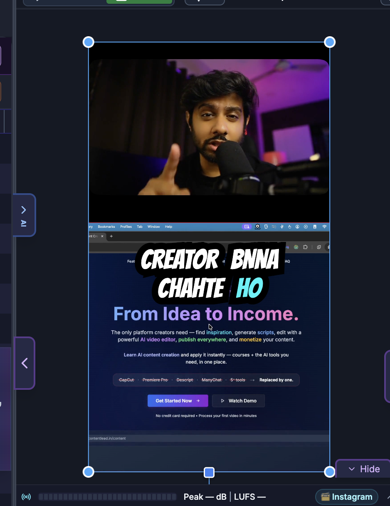

# Canvas Editing (Direct Manipulation)

> **For humans — and for AI helping humans.** This document describes how a person edits video by
> hand using the on-screen controls of the SkillTown video editor. It is **not** an AI skill or an
> automation API, so if you are an AI agent, do **not** treat these steps as callable commands — for
> programmatic/automated editing use the agent skills and commands documented elsewhere (see
> `_Agent/AGENTS.md`). **You may, however, read this doc to answer a user's "how do I…" questions
> and walk them, step by step, through performing these actions themselves in the editor UI.**

> Work directly on the preview: select, move, resize, rotate, and align items right on the canvas — with live snapping guides — instead of typing numbers into the properties panel.

## Where to find it

The **canvas** is the large preview area in the center of the editor. Anything visible at the current playhead time can be grabbed and edited directly with your mouse or trackpad. Changes you make on the canvas are the same as changes made through the properties panel — use whichever is faster for the task.

The canvas is also a drop target: it shows a **Droppable area for images, videos, and audio** highlight when you drag files or library items over it.

## What you can do

- Click an item on the canvas to select it and open its properties panel.
- Drag an item to reposition it.
- Drag the corner and edge handles to resize or scale.
- Hold **Shift** while dragging a handle to lock the aspect ratio.
- Drag the rotation handle to rotate.
- Select several items and move, resize, or rotate them together.
- Use the live snapping guides to align to other items' edges, centers, and middles.
- Drag media from the library — or files from your computer — straight onto the canvas.
- Crop an image or video using on-canvas edge handles in crop mode.

## How to select items on the canvas

1. Click an item to select it. A selection box with handles appears around it, and the properties panel opens on the right.
2. **Shift**-click another item to add it to the selection (or remove it if already selected).
3. Click an empty area of the canvas to deselect everything.
4. Overlapping items select the top-most one first; keep clicking to reach items beneath, or select them from the timeline instead.

Items on a locked or hidden track can't be selected or changed on the canvas until you unlock or show that track.

## How to move items

1. Select the item.
2. Drag anywhere inside its selection box to move it.
3. As you drag, snapping guides appear when the item lines up with another item's edge, horizontal center, or vertical middle — release while a guide is showing to snap to it.
4. To move several items at once, select them all first, then drag any one of them; the whole group moves together and keeps its internal spacing.

## How to resize and scale

1. Select the item to reveal its handles.
2. Drag a **corner handle** to resize from that corner, or an **edge handle** to stretch one side.
3. Hold **Shift** while dragging to keep the original proportions (aspect-ratio lock). Release Shift mid-drag to resize freely again — the lock updates immediately.
4. Some item types keep their proportions by default; holding Shift still forces proportional resizing for the ones that don't.
5. For precise sizes, type exact values in the properties panel instead (see [Item Properties](07-item-properties.md)).

When several items are selected, dragging a handle scales the whole selection together.

## How to rotate

1. Select the item.
2. Grab the rotation handle (the handle that sits away from the box) and drag left or right.
3. Release at the angle you want.
4. To set an exact angle, use the rotation field in the properties panel.

Selecting multiple items lets you rotate them all around the group as one.

## How to use snapping guides

- Guides appear automatically while you drag, resize, or rotate, and disappear when you release.
- They snap to other items' **top**, **bottom**, **left**, **right**, **center**, and **middle** lines, so items align cleanly without guesswork.
- If you need to place something without snapping, move it in small steps or fine-tune the position numerically in the properties panel.
- Snapping on the canvas is separate from magnetic snapping on the timeline (which snaps clip timing, not on-screen position) — see [Timeline & Selection](06-timeline-and-selection.md).

## How to crop on the canvas

1. Select an image or video and turn on crop mode (the **Crop** control in the properties panel, or the crop action in the right-click menu).
2. In crop mode the edge handles trim what's visible instead of resizing the whole item, so you can frame just the part you want.
3. Adjust the handles, then leave crop mode to apply the crop.

See [Item Properties](07-item-properties.md) for the numeric crop and scale (**Fill**, **Fit**, **Original**, **Custom**) options.

## How to add media by dragging onto the canvas

1. Drag a photo, video, or audio clip from the media library, or drag a file from your computer.
2. As you drag over the preview, the canvas highlights as a **Droppable area for images, videos, and audio**.
3. Release to drop it in. Images and videos are placed on the canvas; audio is added to the timeline.

You can also add media from the menu panel without dragging — see [Media Library](02-media-library.md).

## Tips & good to know

- The canvas is WYSIWYG: what you position here is exactly what appears in the exported video.
- Use the canvas for quick visual placement, and the properties panel when you need exact numbers.
- Hold **Shift** for aspect-ratio lock whenever you resize photos or logos so they don't distort.
- If an item won't move or resize, check that its track isn't locked or hidden.
- To nudge a selection by tiny amounts, use the keyboard nudge shortcuts — see [Keyboard Shortcuts](14-keyboard-shortcuts.md).

## Related

- [Overview & Navigation](01-overview-and-navigation.md)
- [Item Properties](07-item-properties.md)
- [Timeline & Selection](06-timeline-and-selection.md)
- [Right-click Menus](15-right-click-menus.md)
- [Media Library](02-media-library.md)
- [Keyboard Shortcuts](14-keyboard-shortcuts.md)
